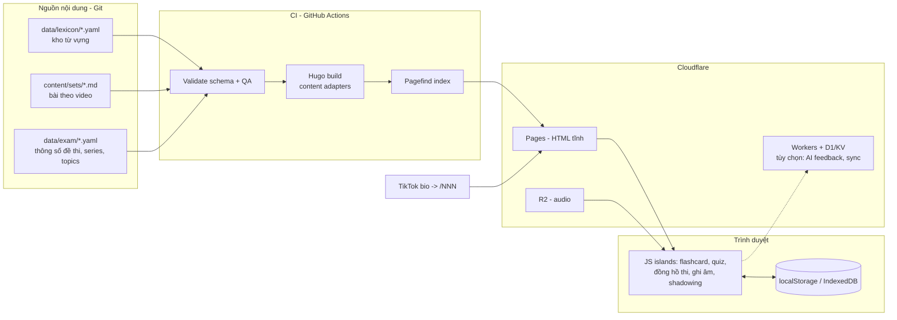
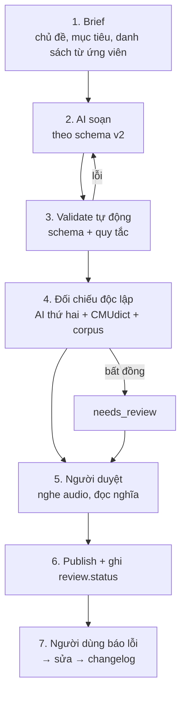

# Kế hoạch Mở rộng Web Glory 01 – TOEIC Speaking (Bản bàn giao cho AI)

**Phiên bản:** 1.0 · **Ngày lập:** 10/10/2026 · **Áp dụng cho repo:** `vinh-gogo/GLORY-TIKTOK` (Hugo + PaperMod + Cloudflare Pages)
**Tài liệu gốc:** `PLAN_TikTok_TOEIC_Speaking.md` (trạng thái: 8 trang tính năng Live, 3 set bài học: 001, 002, 013)

> **Cách dùng file này:** Giao cho AI theo từng **Task Card** (Phụ lục C). Mỗi card có file cần chạm, tiêu chí nghiệm thu. AI **bắt buộc đọc Mục 2 (Nguyên tắc) và Phụ lục D (Hợp đồng làm việc với AI)** trước khi làm bất cứ việc gì.

---

## 0. Tóm tắt điều hành

**Tầm nhìn:** Biến web từ "kho lưu trữ video" thành **nền tảng tự học TOEIC Speaking hoàn chỉnh**: học từ → nghe phát âm → luyện phản xạ có bấm giờ như thi thật → tự đánh giá → ôn lặp lại ngắt quãng. TikTok vẫn là cửa ngõ thu hút; web là nơi người học ở lại và quay lại mỗi ngày.

**3 trụ cột:**

| Trụ cột | Nội dung | Kết quả cuối cùng |
| :--- | :--- | :--- |
| **Nội dung chính xác & nhiều** | ~340 bài gốc + ~30 bài ôn tập, ~2.500 từ/cụm từ có kiểm chứng | Phủ đủ 5 dạng bài (Q1–Q11), 30 chủ đề, 10 đề mô phỏng |
| **Công cụ học thực sự** | Từ điển A–Z, audio, flashcard SRS, quiz, đồng hồ thi, ghi âm, shadowing | Người học luyện được cả khi không xem TikTok |
| **Kiến trúc mở rộng được** | Dữ liệu tách khỏi giao diện (lexicon), schema có version, CI kiểm tra tự động | Thêm 1 bài = thêm 1 file; thêm 1 kỹ năng/kỳ thi = không phá URL cũ |

**Thay đổi kiến trúc quan trọng nhất:** chuyển từ "từ vựng nằm lẻ trong front matter từng set" sang **"một kho từ vựng trung tâm (lexicon) + các set chỉ tham chiếu"**. Việc này cho phép tự sinh trang từ, glossary, flashcard, quiz, tìm kiếm mà không nhân bản dữ liệu.

**Lộ trình tổng thể (1 người + AI hỗ trợ):** 8 giai đoạn, khoảng 6–7 tháng cho phần hệ thống; phần nội dung chạy song song theo nhịp video TikTok (1 video/ngày ≈ 1 năm cho toàn bộ ~340 bài).

---

## 1. Phân tích hiện trạng & khoảng trống

### 1.1. Điểm mạnh cần giữ
- Schema từ vựng giàu (POS, IPA, level, từ dễ nhầm chữ/âm, dễ nhầm nghĩa, collocations song ngữ, ví dụ song ngữ).
- URL ổn định theo số 3 chữ số + alias ngắn (`/013`) rất hợp với việc gõ từ màn hình TikTok.
- Static-first (Hugo, build ~130ms), chi phí gần như bằng 0, deploy tự động.
- Mobile-first, Light/Dark tự động.

### 1.2. Khoảng trống (gap) – xếp theo mức ảnh hưởng

| # | Khoảng trống | Hệ quả | Giai đoạn xử lý |
| :-: | :--- | :--- | :-: |
| G1 | Từ vựng lưu **lẻ trong từng set** (nhân bản "confused words", collocations…) | Không thể tạo glossary/flashcard/quiz sạch; sửa 1 từ phải sửa nhiều nơi | P1 |
| G2 | Chỉ có **3 set** (001, 002, 013); thiếu 003–012 | Nội dung mỏng, SEO yếu | P0 + P2 |
| G3 | Phần luyện nói (Sample Response) nằm **trong thân Markdown** không có cấu trúc | Không thể làm đồng hồ thi, model answer, shadowing | P1, P4 |
| G4 | **Không có audio**, chỉ có IPA | Học phát âm kém hiệu quả (đặc biệt người Việt) | P3 |
| G5 | `level: "TOEIC 550+"` **chưa có nguồn/cơ sở** (ETS không công bố danh sách từ theo điểm) | Rủi ro thông tin sai/gây hiểu lầm | P0 (xác định lại) |
| G6 | Fuse.js lập chỉ mục cả `content` | Khi vượt ~300 trang, file `index.json` phình to, chậm trên mobile | P1 |
| G7 | Không có **CI kiểm tra dữ liệu** (IPA, thiếu nghĩa, trùng id…) | Lỗi sẽ tăng theo số lượng bài | P0 |
| G8 | Không có công cụ **ôn tập lặp lại / theo dõi tiến độ** | Người học xem 1 lần rồi bỏ | P3, P5 |
| G9 | Không có **lộ trình học** theo mục tiêu điểm | Người mới không biết bắt đầu từ đâu | P5 |
| G10 | Chưa có kênh **báo lỗi nội dung**, analytics, 404, sitemap theo series | Khó cải thiện chất lượng bằng dữ liệu | P0, P6 |
| G11 | Embed TikTok tải script bên thứ ba ngay khi mở trang | Chậm, vấn đề riêng tư | P1 (click-to-load) |
| G12 | Giới hạn của Cloudflare Pages (số file/deploy) khi thêm audio + trang từ | Có thể không deploy được | P3 (dùng R2 cho audio) |

---

## 2. Nguyên tắc chỉ đạo

### 2.1. Nguyên tắc về độ chính xác (ưu tiên số 1)
1. **Không bịa.** AI không được tự "nhớ" IPA/nghĩa/collocation rồi ghi thẳng. Mọi mục phải qua pipeline kiểm tra ở Mục 6. Mục không chắc phải ghi `review.status: needs_review`, **không** đoán.
2. **Nội dung gốc, không sao chép.** Không chép đề thi thật của ETS, không chép định nghĩa/ví dụ nguyên văn từ từ điển có bản quyền (Cambridge, Oxford, Longman…). Chỉ dùng chúng để **đối chiếu**; câu chữ phải tự viết. Đề luyện là **"ETS-style" tự tạo**, ghi rõ trên web.
3. **Minh bạch về `level`.** Không dùng nhãn như "TOEIC 550+" như thể là chuẩn chính thức. Thay bằng hệ phân cấp biên tập (xem 3.3) kèm ghi chú cơ sở.
4. **Phân tầng độ tin cậy:** `ai_draft` → `ai_cross_checked` → `human_verified`. Chỉ nội dung từ `ai_cross_checked` trở lên được publish; `human_verified` có huy hiệu.
5. **Mọi thông số kỳ thi** (số câu, thời gian chuẩn bị/trả lời, thang điểm) lưu **một nơi** (`data/exam/toeic-speaking.yaml`), có link nguồn ETS và ngày kiểm chứng; các trang và đồng hồ thi đều đọc từ đó.

### 2.2. Nguyên tắc về kiến trúc (chuẩn thiết kế hệ thống)
1. **Data-first / Single Source of Truth:** dữ liệu là cốt lõi, giao diện chỉ là phép chiếu.
2. **Schema có phiên bản** (`schema_version`) + script migrate; không phá dữ liệu cũ.
3. **URL là hợp đồng:** không đổi slug đã public; nếu buộc đổi, thêm redirect trong `static/_redirects`.
4. **Progressive enhancement:** HTML tĩnh dùng được 100% khi tắt JS; JS chỉ nâng cấp (flashcard, đồng hồ…).
5. **Static-first, Edge-when-needed:** chỉ dùng Cloudflare Workers/D1/R2 cho tính năng thật sự cần máy chủ (AI feedback, đồng bộ tiến độ).
6. **Privacy by default:** dữ liệu luyện tập, bản ghi âm **ở lại trên thiết bị**; không thu thập thông tin cá nhân nếu chưa có đồng ý.
7. **Mỗi quyết định kiến trúc ghi 1 ADR** (`docs/adr/NNN-ten.md`: bối cảnh – quyết định – hệ quả).
8. **Ngân sách hiệu năng:** Lighthouse mobile ≥ 90; trang bài học ≤ 300 KB (chưa tính audio); audio tải lười (lazy).
9. **Kiểm tra tự động trước khi merge** (CI gates ở Mục 9).

### 2.3. Nguyên tắc về sư phạm
- Mỗi bài có **mục tiêu học tập đo được** (vd: "dùng đúng 4 collocations của *deadline* trong câu trả lời 30s").
- Từ vựng luôn đi kèm **ngữ cảnh nói** (dùng ở câu Q nào, mẫu câu nào).
- **Vòng lặp học:** Học (video/thẻ từ) → Nghe (audio) → Nói (luyện bấm giờ) → Ôn (SRS).
- Lưu ý đặc thù người Việt: âm cuối (-s, -ed, -t, -d), cụm phụ âm, trọng âm, thiếu mạo từ/chia thì.

---

## 3. Kiến trúc hệ thống mục tiêu

### 3.1. Sơ đồ tổng thể



### 3.2. Cấu trúc thư mục đề xuất (v2)

```
GLORY-TIKTOK/
├── data/
│   ├── lexicon/                 # KHO TỪ VỰNG TRUNG TÂM (1 file / 1 từ)
│   │   ├── a/ ...  d/deadline.yaml ...
│   ├── exam/
│   │   └── toeic-speaking.yaml  # 11 câu, thời gian, thang điểm, link nguồn ETS, ngày kiểm chứng
│   ├── series.yaml              # danh mục series bài học (A–J)
│   ├── topics.yaml              # 30 chủ đề + mô tả
│   └── paths.yaml               # lộ trình học theo mục tiêu điểm
├── content/
│   ├── sets/                    # bài theo video (set-001 ... set-340+)
│   ├── words/_content.gotmpl    # Content Adapter: sinh /words/<slug>/ từ data/lexicon
│   ├── glossary/_index.md
│   ├── paths/                   # lộ trình/kế hoạch học
│   ├── mock-tests/              # đề mô phỏng
│   ├── tools/                   # trang công cụ: flashcards, timer, recorder
│   └── guides/ about.md search.md
├── layouts/
│   ├── shortcodes/              # words, tiktok (click-to-load), audio, practice, quiz
│   ├── words/single.html        # trang từ
│   └── partials/                # json-ld, og-image, report-error
├── assets/
│   ├── css/extended/
│   └── js/                      # modules: srs.js, timer.js, recorder.js, store.js (ES modules)
├── scripts/
│   ├── validate/                # kiểm tra schema + QA (Python)
│   ├── migrate/                 # v1 -> v2
│   ├── audio/                   # sinh audio hàng loạt
│   └── ipa/                     # đối chiếu CMUdict
├── docs/adr/                    # Architecture Decision Records
├── schemas/                     # JSON Schema: word.v2.json, set.v2.json
├── .github/workflows/           # ci.yml
├── AGENTS.md                    # Hợp đồng làm việc với AI (xem Phụ lục D)
└── static/_redirects  static/images/ ...
```

### 3.3. Mô hình dữ liệu v2

**Thực thể chính và quan hệ**

| Thực thể | Khóa | Quan hệ |
| :--- | :--- | :--- |
| `Word` (lexicon) | `id` (slug, vd `deadline`) | thuộc nhiều `Topic`; có nhiều `Sense`; liên kết `confusions`, `collocations` |
| `Set` (bài/video) | `NNN` (vd `013`) | tham chiếu nhiều `Word`; thuộc 1 `Series`, nhiều `Topic`, 1+ `Part` |
| `Series` | A–J | gom Set theo mục tiêu sư phạm |
| `Part` | 5 giá trị chuẩn ETS | gắn với Q1–Q11 + thông số thời gian |
| `Path` | slug | chuỗi Set theo mục tiêu điểm |
| `MockTest` | `mock-01…10` | 11 câu hỏi + đáp án mẫu + audio |

**Hệ phân cấp `level` (thay cho nhãn "TOEIC 550+"):**
- `cefr`: A2 / B1 / B2 / C1 (đối chiếu từ điển/CEFR-J/Oxford level – chỉ lưu nhãn, không chép nội dung).
- `band`: `core` (cần thiết cho điểm nền), `target` (cần cho mức 130–160), `advanced` (cho 160+). Đây là **phân loại biên tập** của kênh, ghi rõ `basis` (tần suất trong danh sách từ kinh doanh/TOEIC nào, hoặc tự đánh giá).
- Có thể giữ hiển thị thân thiện "TOEIC 550+" **chỉ khi** Phase 0 xác định được cơ sở rõ ràng; nếu không, chuyển sang `core/target/advanced` và ghi chú trên web.

**Ví dụ file `data/lexicon/d/deadline.yaml`:**

```yaml
schema_version: 2
id: deadline
lemma: deadline
pos: [noun]
ipa: { us: "/ˈdedlaɪn/" }
audio: { us: "words/deadline-us.mp3" }       # lưu trên R2, đường dẫn tương đối
level: { cefr: B1, band: core, basis: "editorial" }
topics: [work, meetings]
speaking_use: [respond-to-questions, express-opinion]   # dùng tốt ở dạng bài nào
senses:
  - id: deadline-1
    meaning_vi: "Hạn chót, thời hạn cuối cùng phải hoàn thành công việc"
    note_vi: "Nhấn áp lực thời gian của công việc/dự án."
confused_words:           # nhầm chữ/âm
  - ref: timeline         # tham chiếu id trong lexicon (nếu có) hoặc inline
    kind: spelling-sound
    difference_vi: "Deadline là 1 mốc chót; timeline là toàn bộ lộ trình các giai đoạn."
  - ref: lifeline
    kind: sound
    difference_vi: "Tránh đọc nhầm âm đầu dead- /ded/ thành life- /laɪf/."
confusing_meanings:       # nhầm nghĩa
  - ref: due-date
    difference_vi: "Deadline: áp lực hoàn thành công việc; due date: ngày đáo hạn tiền/giấy tờ."
collocations:
  - { phrase: "meet a deadline",   meaning_vi: "kịp hạn chót",       evidence: "corpus" }
  - { phrase: "miss a deadline",   meaning_vi: "trễ hạn chót",       evidence: "corpus" }
  - { phrase: "tight deadline",    meaning_vi: "hạn chót gấp gáp",   evidence: "corpus" }
  - { phrase: "extend the deadline", meaning_vi: "gia hạn thời gian nộp", evidence: "corpus" }
synonyms:
  - { word: "target date", meaning_vi: "ngày mục tiêu" }
examples:
  - en: "We often have to work overtime to meet tight deadlines at the end of the quarter."
    vi: "Chúng tôi thường phải làm thêm giờ để kịp các hạn chót gấp gáp vào cuối quý."
    audio: "examples/deadline-1.mp3"
pronunciation_tips_vi: "Âm cuối /laɪn/ kéo dài; trọng âm rơi vào âm tiết đầu."
review:
  status: ai_cross_checked      # ai_draft | ai_cross_checked | human_verified | needs_review
  checked_by: ["model-b", "cmudict"]
  checked_at: 2026-10-10
  sources: ["cmudict", "dictionary-ref"]   # chỉ tên nguồn đối chiếu, không chép nội dung
```

**Ví dụ `content/sets/set-013.md` (v2):**

```yaml
---
schema_version: 2
title: "Set 013 – Từ vựng công việc hằng ngày"
date: 2026-10-09
draft: false
summary: "Deadline, workload, giờ giấc linh hoạt, đi lại công sở – kèm phân tích từ dễ nhầm."
series: "A-vocab-topic"
seq: 13
topics: ["work"]
parts: ["respond-to-questions"]
level_band: core
learning_objectives:
  - "Dùng đúng ≥3 collocations của deadline trong câu trả lời 30s"
  - "Phân biệt deadline/timeline/due date"
prerequisites: ["set-001"]
next: ["set-014"]
tiktok: "https://www.tiktok.com/@glory01/video/1234567890"
aliases: ["/013"]
words: [deadline, workload, flexible-hours, commute, overtime, schedule]   # CHỈ id tham chiếu lexicon
practice:                      # có cấu trúc để sinh đồng hồ/model answer
  - part: respond-to-questions
    q_no: 7
    prompt: "Do you prefer working fixed hours or having a flexible schedule? Why?"
    prep_s: 3
    response_s: 30
    model_answer: "Personally, I prefer flexible hours for two main reasons..."
    target_words: [flexible-hours, deadline]
    audio: "practice/set-013-q7.mp3"
review: { status: ai_cross_checked, checked_at: 2026-10-10 }
---



```

> **Tương thích ngược:** Shortcode `words` nhận cả `words:` v1 (object inline) lẫn v2 (id). Script `scripts/migrate/v1_to_v2.py` chuyển 3 set hiện có sang lexicon, không đổi URL.

### 3.4. Quyết định công nghệ (kèm lý do)

| Hạng mục | Lựa chọn | Lý do | Ghi chú rủi ro |
| :--- | :--- | :--- | :--- |
| Sinh trang từ từ dữ liệu | **Hugo Content Adapters** (`_content.gotmpl`) | Sinh hàng nghìn trang từ YAML mà không cần file `.md` riêng | Cần Hugo ≥ 0.126 (dự án đang dùng 0.167 → ổn); AI cần xác minh cú pháp theo tài liệu Hugo hiện hành |
| Tìm kiếm | Chuyển từ Fuse.js sang **Pagefind** (index tĩnh, tải theo mảnh) | Không phình `index.json` khi >300 trang | Phải kiểm thử tìm không dấu tiếng Việt ("tinh nang" ra "tính năng"); nếu kém, giữ Fuse cho `title/summary/word` và Pagefind cho nội dung |
| Audio | **Cloudflare R2** + CDN (`audio.glory.one.learns.dev`) | Tránh giới hạn số file mỗi lần deploy của Pages; có thể thay engine sau | Xác minh giới hạn Pages hiện hành ở Phase 0; kiểm tra giấy phép sử dụng đầu ra của engine TTS |
| JS phía client | **ES modules thuần** (không framework) hoặc Alpine.js nếu cần | Nhẹ, hợp static site, dễ cho AI viết/kiểm | Tránh dựng SPA |
| Lưu tiến độ | **localStorage / IndexedDB** + xuất/nhập JSON | Không cần tài khoản, riêng tư | Mất dữ liệu khi xóa trình duyệt → cung cấp nút sao lưu |
| Backend tùy chọn | **Workers + D1/KV** | Chỉ khi cần AI feedback/đồng bộ | Cần rate-limit, chi phí API |
| CI | **GitHub Actions** (validate → build → link check) | Chặn lỗi dữ liệu trước khi Cloudflare build | Cloudflare chỉ build khi CI xanh (branch protection) |
| Quan sát | Cloudflare Web Analytics (không cookie) + UTM cho link TikTok | Đo CTR TikTok→web mà vẫn riêng tư | — |

---

## 4. Lộ trình theo giai đoạn

> Mốc thời gian giả định **1 người + AI hỗ trợ**, làm part-time. Có thể co giãn; thứ tự phụ thuộc mới là quan trọng. Nội dung (Mục 5) chạy **song song** từ P2.

### Tổng quan

| GĐ | Tên | Thời lượng | Mục tiêu một câu | Kết quả đo được |
| :-: | :--- | :-: | :--- | :--- |
| **P0** | Nền móng & Chuẩn hóa | 1–2 tuần | Làm sạch nền, đặt luật chơi, chặn lỗi sớm | CI xanh, 3 set migrate xong, thông số đề thi được kiểm chứng |
| **P1** | Lexicon & Glossary | 3–4 tuần | Kho từ trung tâm, tự sinh trang từ + A–Z + tìm kiếm mới | ≥100 từ có trang riêng; `/glossary/` Live |
| **P2** | Content Scale I | 5–6 tuần (song song) | Lấp 003–012, mở rộng lên 60 bài | 60 set `ai_cross_checked`+ |
| **P3** | Audio & Công cụ ôn tập | 4–5 tuần | Nghe được, ôn được, in được | Audio cho 100% từ mới; flashcard SRS + quiz Live |
| **P4** | Speaking Lab | 4–5 tuần | Luyện nói như thi thật | Đồng hồ Q1–Q11, ghi âm, shadowing, mock test #1–3 |
| **P5** | Lộ trình & Cá nhân hóa | 4 tuần | Người mới biết học gì, mỗi ngày | 4 lộ trình + dashboard tiến độ + PWA offline |
| **P6** | AI Feedback, Cộng đồng, Tối ưu | 4–6 tuần | Phản hồi tự động, vòng lặp cải tiến bằng dữ liệu | Báo lỗi, AI feedback beta, báo cáo analytics hằng tháng |
| **P7** | Scale & Hệ sinh thái | liên tục | Mở rộng kỳ thi/kỹ năng, API dữ liệu, ổn định lâu dài | 340+ bài, khung đa kỳ thi, export dữ liệu mở |

---

### P0 – Nền móng & Chuẩn hóa (Tuần 1–2)

**Mục tiêu:** Không thêm tính năng mới; làm cho nền đủ chắc để nhân rộng nội dung mà không tăng lỗi.

**Công việc**
1. **Kiểm toán nội dung hiện có** (set 001, 002, 013): rà IPA, nghĩa, collocations; sửa lỗi.
2. **Xác minh thông số đề thi** từ nguồn ETS chính thức (số câu, thời gian chuẩn bị/trả lời từng câu, thang điểm, 8 mức) → ghi vào `data/exam/toeic-speaking.yaml` kèm URL + ngày kiểm chứng. *(Ghi chú xem Mục 10: một số số liệu chưa được đối chiếu hết.)*
3. **Quyết định cách ghi `level`** (3.3) và ghi ADR-001.
4. Viết **JSON Schema** `word.v2.json`, `set.v2.json` + `scripts/validate/`.
5. **CI GitHub Actions:** validate → `hugo --gc --minify` → kiểm tra link hỏng.
6. Thêm `AGENTS.md` (Phụ lục D), `docs/adr/`, template PR, issue template "Báo lỗi nội dung".
7. Thêm trang 404, `robots.txt`, sitemap, favicon, Cloudflare Web Analytics, UTM cho link bio.
8. Kiểm tra **giới hạn hiện hành của Cloudflare Pages** (số file/deploy, kích thước file) → ghi vào ADR (quyết định audio lên R2 hay không).
9. Viết script `v1_to_v2` (chưa chạy hàng loạt).

**Đầu ra:** `schemas/`, `scripts/validate/`, `.github/workflows/ci.yml`, `data/exam/toeic-speaking.yaml`, `AGENTS.md`, ADR-001…003.
**Tiêu chí hoàn thành (DoD):** CI xanh trên `main`; 3 set hiện có qua validate; mọi thông số đề thi có nguồn.
**KPI:** 0 lỗi schema; thời gian build < 10s.
**Rủi ro:** Over-engineering → giới hạn P0 trong 2 tuần.

---

### P1 – Lexicon & Glossary (Tuần 3–6)

**Mục tiêu:** Chuyển sang mô hình dữ liệu trung tâm; có từ điển A–Z và tìm kiếm chịu tải.

**Công việc**
1. Tạo `data/lexicon/` và **migrate** từ vựng của set 001, 002, 013 (script `v1_to_v2`); alias/URL set không đổi.
2. **Content Adapter** sinh `/words/<slug>/`: hiển thị nghĩa, IPA, POS, level, collocations, confusions (liên kết chéo), ví dụ, "xuất hiện trong set nào", "dùng ở câu Q nào".
3. **Trang `/glossary/`**: bảng A–Z, lọc theo chủ đề/POS/level/dạng bài; sắp xếp; phân trang; chip "đã kiểm duyệt".
4. **Cập nhật shortcode `words`** để tra từ lexicon (giữ tương thích v1).
5. **Pagefind**: thay/bổ sung tìm kiếm; thử tìm không dấu.
6. **TikTok click-to-load** (facade): ảnh/nút → bấm mới nạp embed (nhanh hơn, riêng tư hơn).
7. Taxonomy mới: `series`, `level_band`; trang `_index.md` mô tả cho `/topics/`, `/parts/`, `/series/`.
8. Chuyển `practice` sang dạng có cấu trúc; shortcode `practice` hiển thị đề + đáp án mẫu (thu gọn/mở rộng).
9. Dữ liệu có cấu trúc **JSON-LD** (`LearningResource`/`Course`) + OG image tự sinh cho mỗi set.
10. Nút **"Báo lỗi nội dung"** trên mỗi từ/set → mở GitHub Issue điền sẵn (tên trang, id từ).

**Đầu ra:** `layouts/words/`, `content/words/_content.gotmpl`, `content/glossary/`, shortcodes mới, Pagefind trong CI.
**DoD:** `/glossary/` Live; ≥100 từ có trang; tìm "deadline", "han chot" đều ra kết quả đúng.
**KPI:** Lighthouse mobile ≥ 90; chỉ mục tìm kiếm tải đầu < 100 KB.
**Rủi ro:** Cú pháp Content Adapter sai → AI phải đối chiếu tài liệu Hugo, có test build.

---

### P2 – Content Scale I (Tuần 5–10, song song)

**Mục tiêu:** Từ 3 → 60 bài, ưu tiên bài "nền" đem lại giá trị nhanh.

**Thứ tự ưu tiên nội dung**
1. Lấp **003–012** (đang thiếu) bằng Series A (từ vựng theo chủ đề) hoặc bài đã quay.
2. **Series A** – 10 chủ đề đầu × 4 set = 40 bài (work, meetings, email, phone, shopping, restaurants, travel, hotels, transport, health).
3. **Series B/C starter:** 6 bài phát âm cho người Việt + 6 bài Describe-a-picture (office, restaurant, street, station, shop, meeting).
4. **Series D starter:** 8 bài Q5–Q7 chủ đề phổ biến.

**Pipeline sản xuất (xem Mục 6):** brief → AI soạn → validate tự động → AI thứ hai đối chiếu → người duyệt → publish.
**DoD:** 60 set ở trạng thái `ai_cross_checked`+; mỗi set có `learning_objectives`, `practice` có cấu trúc, ≥6 từ chuẩn schema.
**KPI:** Tỉ lệ lỗi do người đọc báo < 1 lỗi/100 mục nội dung; ≥ 80% set có ≥1 bài luyện nói có model answer.

---

### P3 – Audio & Công cụ ôn tập (Tuần 9–14)

**Mục tiêu:** Người học **nghe** đúng và **ôn** đều.

**Công việc**
1. **Audio hàng loạt** (script `scripts/audio/`): từ, ví dụ, câu mẫu; tên file theo id; manifest `audio-manifest.json` (hash, thời lượng, engine, giấy phép). Chọn engine TTS có giấy phép cho phép dùng thương mại; ghi ADR. Giọng US chuẩn trước; UK là tùy chọn.
2. **Shortcode `audio`**: nút phát, tốc độ 0.75×/1×, tải lười.
3. **Flashcard SRS** (`/tools/flashcards/`): thuật toán SM-2 hoặc FSRS; bộ thẻ theo set/chủ đề/level; mặt trước: từ + IPA + audio; mặt sau: nghĩa, collocation, ví dụ; lưu `localStorage`; xuất/nhập JSON.
4. **Quiz** (`/tools/quiz/`): 5 dạng – chọn nghĩa, điền chỗ trống bằng collocation, **phân biệt cặp dễ nhầm**, nghe chọn từ, sắp xếp câu. Dữ liệu sinh từ lexicon (không viết tay).
5. **In/Tải PDF** cho từng set/chủ đề (print CSS; hoặc PDF sinh khi build).
6. **Bài ôn tập định kỳ:** tự sinh "Review set" mỗi 10 set từ các từ đã dạy.

**DoD:** 100% từ mới có audio; flashcard và quiz chạy offline sau lần tải đầu; in A4 đẹp.
**KPI:** ≥ 25% phiên truy cập vào trang set có phát audio; tỉ lệ quay lại 7 ngày ≥ 15% (mục tiêu đề xuất, điều chỉnh theo thực tế).
**Rủi ro:** Giới hạn file/deploy → dùng R2; TTS phát âm sai từ riêng → danh sách ngoại lệ + kiểm nghe mẫu.

---

### P4 – Speaking Lab (Tuần 14–19)

**Mục tiêu:** Luyện **nói** thật, mô phỏng điều kiện thi.

**Công việc**
1. **Đồng hồ thi** (`/tools/timer/`): đọc `data/exam/toeic-speaking.yaml`; chạy từng câu Q1–Q11 với thời gian chuẩn bị/trả lời, tiếng bíp, thanh tiến trình; chế độ "một câu" và "cả đề".
2. **Ghi âm cục bộ** (MediaRecorder): ghi → nghe lại → so sánh với model audio; **không upload**. Xử lý quyền micro, trình duyệt iOS/Android, mô tả lỗi thân thiện.
3. **Shadowing mode:** câu-theo-câu, lặp A–B, đổi tốc độ, hiển thị transcript tô sáng.
4. **Tự đánh giá theo rubric** (bảng tiêu chí tự tạo bám theo tiêu chí chấm công khai của ETS: phát âm, ngữ điệu/trọng âm, ngữ pháp, từ vựng, mạch lạc, nội dung). Có tick-list sau mỗi lần nói.
5. **Tự kiểm tra bằng nhận diện giọng nói** (Web Speech API, chỉ trình duyệt hỗ trợ): hiển thị transcript, tốc độ nói (từ/phút), số từ đệm (um, uh), % từ mục tiêu đã dùng. Có fallback khi không hỗ trợ. *Chỉ là gợi ý tự kiểm, không phải điểm thi.*
6. **Mock Test #1–#3** (`/mock-tests/`): 11 câu gốc "ETS-style"; Q1–2 có audio đọc mẫu; Q3–4 có ảnh minh họa **(ảnh phải có bản quyền hợp lệ: tự tạo/ảnh miễn phí cấp phép rõ ràng)**; Q8–10 có tài liệu (lịch trình…); đáp án mẫu + phân tích.
7. **Template-bank:** thư viện mẫu câu theo từng dạng (đã có trong Series H).

**DoD:** Chạy trọn 1 đề 11 câu bằng điện thoại không lỗi; ghi âm hoạt động ở Chrome/Safari di động; mock #1–3 Live.
**KPI:** ≥ 10% người dùng trang set mở ít nhất 1 công cụ Speaking Lab; thời gian ở lại trang công cụ ≥ 3 phút (mục tiêu đề xuất).
**Rủi ro:** Hành vi MediaRecorder khác nhau trên iOS → test thiết bị thật; Web Speech API không ổn định → luôn có chế độ không cần.

---

### P5 – Lộ trình & Cá nhân hóa (Tuần 19–23)

**Mục tiêu:** Người mới **không phải tự mò**; người học cũ có lý do quay lại hàng ngày.

**Công việc**
1. **Bài kiểm tra xếp lớp ngắn** (10–12 câu: từ vựng + phát âm + 1 mẫu nói): ra gợi ý lộ trình.
2. **4 lộ trình theo mục tiêu điểm** (`data/paths.yaml`): Nền tảng (~≤90), Tăng tốc (~100–120), Mục tiêu 130–150, Chinh phục 160+ (các mốc điểm chỉ là định hướng, ghi chú không cam kết điểm). Mỗi lộ trình là chuỗi set + công cụ + đề mô phỏng.
3. **Kế hoạch 14/30/60 ngày** tự sinh từ lộ trình: việc mỗi ngày (video/set → flashcard → luyện nói 5 phút → ôn).
4. **Dashboard tiến độ:** streak, số từ đã học/đang ôn, biểu đồ hoạt động, set đã xong, ghi chú tự đánh giá; lưu cục bộ + sao lưu/khôi phục JSON.
5. **PWA:** manifest, service worker, cache các set đã xem + công cụ → học offline; nhắc học (nếu người dùng bật).
6. Cá nhân hóa nhẹ: ghi nhớ chủ đề yêu thích, cỡ chữ, hiển thị/ẩn IPA.

**DoD:** Cài được lên màn hình chính điện thoại; học được ≥ 10 set đã mở lúc offline.
**KPI:** ≥ 20% người dùng mới chọn 1 lộ trình; retention 7 ngày ≥ 20% (mục tiêu đề xuất).

---

### P6 – AI Feedback, Cộng đồng & Tối ưu (Tuần 23–29)

**Mục tiêu:** Phản hồi cá nhân hóa ở quy mô lớn mà vẫn kiểm soát chi phí/rủi ro; cải tiến bằng dữ liệu thực.

**Công việc**
1. **AI Speaking Feedback (beta):** Cloudflare Worker nhận **transcript** (không gửi file âm thanh mặc định) + đề bài → trả nhận xét theo rubric (từ vựng, ngữ pháp, mạch lạc, từ mục tiêu, gợi ý nâng cấp). Rate limit theo IP/ngày, giới hạn độ dài, lọc lạm dụng, ghi rõ *không phải điểm thi chính thức*. Quản lý API key ở secret của Worker; không để lộ ở client.
2. **Báo lỗi + quy trình xử lý:** Issue → nhãn `content-error` → sửa trong ≤ 7 ngày → ghi changelog.
3. **Trang `/changelog/`** (minh bạch chất lượng) + huy hiệu "Đã kiểm duyệt".
4. **Bình luận/bình chọn nhẹ** (ví dụ giscus/GitHub Discussions) hoặc kênh Telegram/Zalo cộng đồng — chọn theo nhu cầu.
5. **Vòng lặp dữ liệu:** báo cáo analytics hằng tháng → xác định bài được xem nhiều/ít, từ bị tra nhiều, nơi người dùng bỏ → ưu tiên nội dung kế tiếp; đề xuất chủ đề video TikTok mới từ dữ liệu tìm kiếm trên web.
6. **A/B nhẹ** cho CTA từ TikTok → web (copy, vị trí nút).
7. **Hardening:** CSP, header bảo mật (`_headers`), kiểm thử truy cập (WCAG AA), kiểm thử trên màn hình nhỏ, quét link định kỳ.

**DoD:** AI feedback chạy với giới hạn; mọi lỗi nội dung báo qua form được xử lý theo SLA; báo cáo tháng đầu tiên xuất bản.
**KPI:** Độ hài lòng với AI feedback (thumbs up) ≥ 70% (mục tiêu đề xuất); chi phí API/ngày dưới ngưỡng ngân sách đặt trước.
**Rủi ro:** Chi phí/lạm dụng API → hạn mức cứng + tắt khẩn cấp (feature flag); nội dung phản hồi AI sai → luôn kèm cảnh báo và nút báo lỗi.

---

### P7 – Scale & Hệ sinh thái (liên tục)

**Mục tiêu:** Nền tảng sống được dài hạn, mở rộng không đau.

- **Hoàn thiện catalog:** 340+ bài, 10 mock test, ~2.500 từ/cụm từ.
- **Khung đa kỳ thi/kỹ năng:** thêm trường `exam` và `skill` trong dữ liệu; **giữ nguyên URL hiện tại cho TOEIC Speaking**, kỹ năng mới dùng tiền tố mới (`/writing/`, `/listening/`…). Cùng lexicon dùng chung.
- **Dữ liệu mở:** `/api/lexicon.json`, `/api/sets.json` (xuất khi build) để làm app/bot sau này; ghi giấy phép nội dung (vd CC BY-NC-SA) hoặc để "all rights reserved" — **cần quyết định có chủ ý**.
- **Đa ngôn ngữ giao diện** (vi/en) nếu cần, qua Hugo multilingual — chỉ khi có nhu cầu thực.
- **Bảo trì:** rà soát lại nội dung định kỳ 6 tháng; cập nhật khi ETS đổi định dạng; theo dõi cập nhật Hugo/PaperMod (pin phiên bản, nâng cấp có kiểm thử).
- **Mô hình bền vững (tùy chọn):** tài liệu PDF cao cấp, đề mô phỏng thêm, lớp học có hướng dẫn — quyết định sau khi có dữ liệu sử dụng; luôn giữ lõi miễn phí.

---

## 5. Kế hoạch nội dung chi tiết (catalog bài học)

### 5.1. Tổng quan

| Series | Tên | Số bài | Dạng bài ETS | Ghi chú |
| :-: | :--- | :-: | :--- | :--- |
| **A** | Từ vựng theo chủ đề | 120 | Tất cả | 30 chủ đề × 4 set (mỗi set 6–10 từ/cụm) |
| **B** | Phát âm & Read Aloud | 35 | Q1–2 | Âm khó, trọng âm, ngữ điệu, số/ngày giờ, mẫu thông báo |
| **C** | Describe a Picture | 36 | Q3–4 | 30 loại cảnh + 6 bài ngôn ngữ |
| **D** | Respond to Questions | 40 | Q5–7 | Chủ đề khảo sát + khuôn trả lời 15s/30s |
| **E** | Respond using Information | 30 | Q8–10 | Đọc lịch trình/biểu mẫu/quảng cáo và trả lời |
| **F** | Express an Opinion | 30 | Q11 | Khuôn lập luận + chủ đề |
| **G** | Ngữ pháp cho Speaking | 20 | Tất cả | Lỗi thường gặp của người Việt |
| **H** | Mẫu câu chức năng (chunks) | 20 | Tất cả | Xin lỗi, đề nghị, so sánh… |
| **I** | Đề mô phỏng (Mock Test) | 10 | Cả 11 câu | Đề gốc "ETS-style" |
| | **Tổng bài gốc** | **≈ 341** | | + ~30 bài ôn tập tự sinh |

**Quy mô từ vựng:** ~960 từ lõi từ Series A, cộng từ/cụm chức năng ở B–H → mục tiêu **~2.500 mục lexicon**, **~3.000 collocations**, **~1.500 câu ví dụ**, mỗi mục qua pipeline kiểm tra.

> **Số thứ tự set = thứ tự đăng video** (giữ nguyên quy ước hiện tại). Cột `series` + `seq` trong front matter cho phép web sắp xếp theo chương trình học, độc lập với thứ tự đăng.
> Khi số set vượt 999: giữ `set-NNN` đến 999, sau đó dùng `set-NNNN`; alias ngắn vẫn hoạt động.

### 5.2. Series A – 30 chủ đề × 4 set

Công thức 4 set/chủ đề: **(1)** từ lõi (danh từ/động từ) · **(2)** collocations & động từ cụm · **(3)** tính từ/trạng từ/diễn đạt · **(4)** cặp dễ nhầm + ôn tập chủ đề.

| # | Chủ đề (slug) | Gợi ý nhóm từ trọng tâm |
| :-: | :--- | :--- |
| 1 | Công việc hằng ngày (`work`) | deadline, workload, schedule, overtime, commute |
| 2 | Họp hành (`meetings`) | agenda, minutes, attend, postpone, brainstorm |
| 3 | Email & giao tiếp (`email`) | attachment, forward, reply, inquiry, follow up |
| 4 | Điện thoại & tin nhắn (`phone`) | leave a message, put through, call back, extension |
| 5 | Tuyển dụng & nhân sự (`hiring`) | applicant, résumé, interview, qualification, vacancy |
| 6 | Lương, phúc lợi, nghỉ phép (`benefits`) | salary, bonus, raise, insurance, paid leave |
| 7 | Đào tạo & phát triển nghề (`training`) | workshop, seminar, skill, certificate, promotion |
| 8 | Marketing & quảng cáo (`marketing`) | campaign, promote, target audience, brand, launch |
| 9 | Bán hàng & chăm sóc khách hàng (`sales`) | customer, refund, complaint, warranty, discount |
| 10 | Tài chính & ngân hàng (`banking`) | account, deposit, withdraw, loan, interest |
| 11 | Kế toán & ngân sách (`budget`) | invoice, expense, revenue, profit, cut costs |
| 12 | Hợp đồng & đàm phán (`contracts`) | sign, terms, negotiate, agreement, deal |
| 13 | Sản xuất & chất lượng (`manufacturing`) | assembly, inspect, defect, production line, safety |
| 14 | Vận chuyển & kho bãi (`logistics`) | shipment, deliver, warehouse, inventory, tracking |
| 15 | Mua hàng & đặt hàng (`purchasing`) | supplier, order, in stock, out of stock, quote |
| 16 | Mua sắm bán lẻ (`shopping`) | cashier, receipt, on sale, fit, browse |
| 17 | Nhà hàng & ăn uống (`dining`) | reservation, menu, appetizer, bill, tip |
| 18 | Du lịch & sân bay (`travel`) | itinerary, boarding pass, delay, baggage, customs |
| 19 | Khách sạn & lưu trú (`hotels`) | check in, vacancy, suite, amenities, front desk |
| 20 | Giao thông & đi lại (`transport`) | commute, traffic, fare, platform, detour |
| 21 | Nhà ở & bất động sản (`housing`) | rent, lease, landlord, utilities, furnished |
| 22 | Sức khỏe & y tế (`health`) | appointment, prescription, symptom, checkup, insurance |
| 23 | Công nghệ & phần mềm (`technology`) | update, install, password, backup, software |
| 24 | Thiết bị văn phòng & bảo trì (`equipment`) | printer, repair, maintenance, malfunction, replace |
| 25 | Sự kiện, hội nghị, triển lãm (`events`) | registration, keynote, venue, exhibit, banquet |
| 26 | Giáo dục & trường học (`education`) | tuition, enroll, lecture, assignment, graduate |
| 27 | Giải trí, truyền thông, nghệ thuật (`media`) | performance, exhibition, broadcast, review, ticket |
| 28 | Thể thao, thể dục, sở thích (`leisure`) | membership, workout, tournament, hobby, join |
| 29 | Môi trường & năng lượng (`environment`) | recycle, pollution, renewable, conserve, waste |
| 30 | Thành phố, cộng đồng, dịch vụ công & thời tiết (`community`) | permit, public library, forecast, volunteer, local |

> Danh sách từ ở cột 3 chỉ là **gợi ý khởi đầu**; từ cuối cùng phải qua pipeline Mục 6 (đối chiếu tần suất/ngữ cảnh) trước khi vào lexicon.

### 5.3. Series B – Phát âm & Read Aloud (35 bài, Q1–2)

| Nhóm | Số bài | Nội dung |
| :--- | :-: | :--- |
| Cặp âm khó (ưu tiên lỗi người Việt) | 8 | /ɪ/–/iː/, /æ/–/e/, /θ/–/s/, /ð/–/d/, /ʃ/–/s/, /tʃ/–/ʃ/, /l/–/n/ cuối từ, /v/–/w/ (xác nhận danh sách bằng tài liệu sư phạm) |
| Âm cuối & cụm phụ âm | 4 | -s/-es (3 cách đọc), -ed (3 cách đọc), cụm phụ âm cuối (-sts, -sks, -lth…), âm /t/ /d/ cuối |
| Trọng âm từ | 3 | Trọng âm danh từ/động từ (record, permit…), hậu tố đổi trọng âm, từ ghép |
| Trọng âm & nhịp câu | 2 | Từ nội dung vs từ chức năng; nhịp stress-timed |
| Ngữ điệu | 4 | Câu khẳng định, Yes/No, WH-, **liệt kê (lên–lên–xuống)** |
| Nối âm & rút gọn | 2 | Linking, weak forms (to, for, of, and) |
| Số, ngày, giờ, tiền, số điện thoại, viết tắt | 5 | Cách đọc số lớn/thập phân, ngày tháng, giờ, giá tiền, mã/viết tắt (Inc., Ltd., a.m./p.m.) |
| Tên riêng & thương hiệu | 1 | Tên người, địa danh, thương hiệu |
| **Mẫu thông báo Read Aloud** | 10 | Cửa hàng, sân bay, điện thoại tự động/voicemail, quảng cáo, bản tin, thời tiết, giới thiệu diễn giả, hướng dẫn viên, radio, thông báo trường/sự kiện |

### 5.4. Series C – Describe a Picture (36 bài, Q3–4)

**30 loại cảnh:** văn phòng; phòng họp; quầy lễ tân; đồng nghiệp trước máy tính; nhà hàng; quán cà phê; chợ/siêu thị; đường phố; ga tàu/sân bay; sảnh khách sạn; công viên; công trường; nhà máy/kho; lớp học/đào tạo; thư viện; hội nghị/hội thảo; bệnh viện/hiệu thuốc; nhà/bếp; ngân hàng/ATM; garage/trạm xăng; trạm xe buýt; sự kiện ngoài trời; thuyết trình; cửa hàng quần áo; nông trại/vườn; phòng gym; bãi đỗ xe; cầu/bến nước; bảo tàng/phòng tranh; quầy check-in.

**6 bài ngôn ngữ:** hiện tại tiếp diễn; giới từ vị trí (foreground/background, on the left…); miêu tả người (trang phục, hành động, biểu cảm); miêu tả đồ vật (màu, hình, chất liệu); **khuôn trả lời** (tổng quan → tiền cảnh → hậu cảnh → suy luận); từ nối & câu đệm khi bí từ.

### 5.5. Series D – Respond to Questions (40 bài, Q5–7)

- **Khuôn 15s (Q5–6):** Trả lời trực tiếp + 1 lý do. **Khuôn 30s (Q7):** Trả lời + 2 lý do + 1 ví dụ ngắn (đối chiếu thời lượng ở `data/exam/`).
- **40 chủ đề khảo sát** (mỗi bài: từ khóa + 3 câu hỏi mẫu Q5/Q6/Q7 + đáp án mẫu + audio): mua sắm; ăn ngoài; nấu ăn; du lịch; đi lại hằng ngày; TV; phim; âm nhạc; đọc sách; Internet/mạng xã hội; điện thoại; email; mua sắm online; tập thể dục; thể thao; thói quen sức khỏe; sở thích; cuối tuần; ngày lễ; sinh nhật/quà tặng; nhà ở/hàng xóm; quê hương; thời tiết; trường học; học ngoại ngữ; công việc; nơi làm việc; ngân hàng; thư viện; bảo tàng; quán cà phê/nhà hàng; phương tiện công cộng; xe hơi; báo chí/tin tức; thời trang; môi trường; tình nguyện; công nghệ; bạn bè; gia đình.
- Mỗi bài kèm **bảng "câu trả lời nâng cấp"**: từ phiên bản cơ bản → phiên bản dùng collocations mục tiêu.

### 5.6. Series E – Respond using Information (30 bài, Q8–10)

- **6 bài chiến thuật:** đọc lướt 45s; đọc số/giờ/ngày; tìm chi tiết nhanh; sửa/đính chính thông tin; tóm tắt nhiều mục; cách nói khi không thấy thông tin.
- **12 loại tài liệu × 2 bài (24):** lịch hội nghị; lịch trình chuyến đi; poster sự kiện; lịch học; lịch phỏng vấn; lịch đào tạo; thông báo họp; lịch webinar; bảng giá; biểu mẫu đăng ký; chương trình tham quan; thông báo bảo trì/đóng cửa.
- *(Dạng câu hỏi chính xác của Q8, Q9, Q10 phải đối chiếu **Examinee Handbook** của ETS ở P0 — không viết theo trí nhớ.)*

### 5.7. Series F – Express an Opinion (30 bài, Q11)

- **8 bài khuôn lập luận:** PREP (Point–Reason–Example–Point); 3 lý do; so sánh A/B; ưu–nhược điểm; mở bài/kết bài; từ nối; quản lý thời gian 60 giây (**xác minh thời lượng**); cách "câu giờ" tự nhiên.
- **22 bài chủ đề:** làm việc tại nhà vs văn phòng; học online vs lớp; mạng xã hội; công nghệ & công việc; chọn việc lương cao vs yêu thích; sống thành phố vs nông thôn; xe riêng vs công cộng; mua online vs cửa hàng; nghề nghiệp lý tưởng; lợi ích của đọc sách; thể thao; du lịch; giáo dục; môi trường; làm việc nhóm vs cá nhân; làm thêm giờ; sếp tốt; đi công tác; kỹ năng nên học; thay đổi công việc; quyên góp/từ thiện; tương lai AI & việc làm.
- Mỗi bài: 2 đáp án mẫu (ý kiến ngược nhau) để người học thấy cùng khuôn nhưng lập trường khác nhau.

### 5.8. Series G – Ngữ pháp cho Speaking (20 bài)

Thì hiện tại đơn/tiếp diễn · quá khứ đơn · hiện tại hoàn thành · tương lai (will/going to) · modal verbs · điều kiện loại 1–2 · so sánh hơn/nhất · bị động trong kinh doanh · mệnh đề quan hệ · V-ing/to V · mạo từ & danh từ đếm/không đếm · giới từ thời gian/nơi chốn · hòa hợp chủ–vị · từ nối (because/however/although) · cấu trúc đưa ra ví dụ · câu hỏi đuôi/gián tiếp · các lỗi hay gặp của người Việt (thiếu -s/-ed, sai thì, thiếu mạo từ) · cách tự sửa khi nói · câu phức nói trôi chảy · tránh dịch word-by-word.

### 5.9. Series H – Mẫu câu chức năng (20 bài)

Mở đầu · cảm ơn · xin lỗi · hỏi lại/nhờ nhắc lại · yêu cầu lịch sự · đề nghị giúp · gợi ý · khuyên bảo · đồng ý/không đồng ý lịch sự · nêu sở thích · đưa lý do · đưa ví dụ · đối lập · trình tự (first, then…) · tóm tắt · diễn đạt không chắc chắn · phàn nàn · xác nhận/đổi lịch · chỉ đường · mô tả xu hướng tăng/giảm.

### 5.10. Series I – 10 đề mô phỏng

Mỗi đề: 11 câu đủ 5 dạng, đồng hồ thi tích hợp, đáp án mẫu + audio, bảng tự chấm theo rubric, phân tích "lỗi hay gặp". Độ khó tăng dần (Mock 1–3: cơ bản; 4–7: chuẩn; 8–10: nâng cao). **Tất cả là đề tự soạn**, không chép từ đề thi thật.

### 5.11. Bài ôn tập tự sinh
Cứ 10 set sinh 1 "Review set" (từ khó sai nhiều, cặp dễ nhầm, 3 câu luyện nói). Có thể đóng gói thành 1 video TikTok "ôn tập tuần".

### 5.12. Lịch phát hành gợi ý

| Mốc | Tổng bài | Trọng tâm |
| :-: | :-: | :--- |
| M0 (hiện tại) | 3 | — |
| M1 (hết P2) | 60 | A (10 chủ đề đầu), B/C/D starter, lấp 003–012 |
| M2 | 120 | A (20 chủ đề), C, D đầy đủ, mock #1–3 |
| M3 | 200 | A hoàn tất, B, E, F bắt đầu |
| M4 | 280 | E, F, G, H |
| M5 | 340+ | Hoàn thiện, mock #4–10, ôn tập |

---

## 6. Quy trình đảm bảo chính xác (Content QA Pipeline)

### 6.1. Các bước



### 6.2. Quy tắc kiểm tra theo trường dữ liệu

| Trường | Cách kiểm | Tự động? |
| :--- | :--- | :-: |
| `ipa` | Đối chiếu từ điển phát âm mở (vd **CMU Pronouncing Dictionary** → chuyển ARPAbet sang IPA US); ký tự IPA nằm trong tập cho phép; từ không có trong CMUdict → `needs_review` | Một phần |
| `pos` | Đối chiếu từ điển + ví dụ có dùng đúng từ loại | Một phần |
| `meaning_vi` | Hai nguồn đối chiếu; nghĩa phải đúng **ngữ cảnh kinh doanh/đời sống**, không dịch máy thô | Không |
| `collocations` | Phải có bằng chứng tần suất (corpus tiếng Anh như COCA hoặc từ điển collocation) — không dựa vào cảm giác; mỗi cụm chứa lemma; có nghĩa tiếng Việt | Một phần |
| `confused_words` | Cặp thật sự dễ nhầm (kiểm bằng danh sách lỗi người học); IPA cả hai; nêu **điểm khác biệt** | Không |
| `examples` | Ngữ pháp tự nhiên (kiểm bằng công cụ như LanguageTool + AI thứ hai); chứa từ mục tiêu; độ dài phù hợp nói | Một phần |
| `level` | Đối chiếu danh sách tần suất công bố (vd. NGSL / Business Service List / TOEIC Service List — **kiểm tra giấy phép từng danh sách**) + `basis` | Một phần |
| `audio` | Nghe mẫu; kiểm từ riêng/viết tắt; manifest có hash | Mẫu |
| `practice` | Thời lượng khớp `data/exam/`; model answer đọc vừa trong `response_s` (ước tính ~110–130 từ/phút → kiểm bằng script) | Có |
| Toàn set | Không trùng id/alias; link hoạt động; `words` đều tồn tại | Có |

### 6.3. Chính sách duyệt
- **Giai đoạn đầu:** người duyệt **100%** IPA, nghĩa, collocation cho đến khi tỉ lệ lỗi < 1% trên 50 set liên tiếp.
- **Sau đó:** duyệt mẫu 25% + 100% mục bị cờ (`needs_review`, AI bất đồng, người dùng báo lỗi).
- **Huy hiệu "Đã kiểm duyệt"** chỉ cho `human_verified`.
- **Changelog công khai** cho mọi sửa đổi nội dung đã publish.

### 6.4. An toàn bản quyền & pháp lý
- Trang `/about/` giữ phần miễn trừ ETS; bổ sung trang **Nguồn & Phương pháp** (cách làm nội dung, nguồn đối chiếu, cách báo lỗi).
- Ảnh cho Q3–4 và mock test: **tự tạo hoặc ảnh có giấy phép sử dụng rõ ràng**; lưu `credit` + `license` trong dữ liệu.
- Audio TTS: lưu engine + điều khoản trong manifest.
- Embed TikTok: click-to-load; ghi chú về bên thứ ba trong trang Chính sách riêng tư.

---

## 7. Đặc tả tính năng học tập (tóm tắt để giao việc)

| Mã | Tính năng | Mô tả ngắn | Dữ liệu nguồn | GĐ |
| :-: | :--- | :--- | :--- | :-: |
| F1 | Từ điển A–Z + trang từ | Lọc theo chủ đề/POS/level/dạng bài | lexicon | P1 |
| F2 | Audio | Phát từ/ví dụ, tốc độ 0.75×/1× | R2 + manifest | P3 |
| F3 | Flashcard SRS | SM-2/FSRS, bộ thẻ theo set/chủ đề/level, xuất/nhập | lexicon | P3 |
| F4 | Quiz sinh tự động | 5 dạng, gồm cặp dễ nhầm và nghe chọn | lexicon | P3 |
| F5 | In/PDF | Bảng từ A4 mỗi set/chủ đề | set + lexicon | P3 |
| F6 | Đồng hồ thi | Q1–Q11 đúng thời gian chuẩn | `data/exam` | P4 |
| F7 | Ghi âm cục bộ | Ghi–nghe lại–so với mẫu | MediaRecorder | P4 |
| F8 | Shadowing | Lặp câu, đổi tốc độ, transcript | practice + audio | P4 |
| F9 | Tự kiểm bằng nhận diện giọng nói | Transcript, WPM, từ đệm, % từ mục tiêu | Web Speech API | P4 |
| F10 | Mock Test | 11 câu liên tục + tự chấm | mock-tests | P4 |
| F11 | Xếp lớp & lộ trình | Gợi ý lộ trình, kế hoạch 14/30/60 ngày | paths | P5 |
| F12 | Dashboard tiến độ | Streak, từ đã học, hoạt động | localStorage | P5 |
| F13 | PWA offline | Học khi không có mạng | service worker | P5 |
| F14 | AI feedback | Nhận xét từ transcript theo rubric | Worker + LLM | P6 |
| F15 | Báo lỗi/Changelog | Cải thiện chất lượng liên tục | GitHub Issues | P1/P6 |
| F16 | Chia sẻ | OG image, nút chia sẻ, deep link `/NNN` | build | P1 |
| F17 | Truy cập (a11y) | Tương phản, cỡ chữ, điều khiển bàn phím, font hỗ trợ IPA | CSS | P0–P6 |

---

## 8. Tích hợp TikTok ↔ Web & Tăng trưởng

1. **Vòng lặp:** Video → CTA "tra từ đầy đủ tại link bio / gõ `/NNN`" → trang set → công cụ ôn → quay lại xem video tiếp.
2. **UTM thống nhất:** `?utm_source=tiktok&utm_medium=bio&utm_campaign=set-NNN` để đo CTR từng video.
3. **Mỗi video có mã set hiển thị trên màn hình** (vd "Tra từ: glory.one.learns.dev/013").
4. **SEO tiếng Việt:** tiêu đề/mô tả có từ khóa ("từ vựng TOEIC Speaking chủ đề …", "cách phát âm …"), mỗi từ có trang riêng (long-tail), sitemap theo nhóm, JSON-LD, liên kết nội bộ (từ ↔ set ↔ chủ đề ↔ dạng bài).
5. **Nội dung tái sử dụng:** từ dữ liệu sinh gợi ý script video mới (từ có nhiều lượt tra, cặp dễ nhầm hay sai).
6. **Newsletter/Kênh cộng đồng:** thu thập qua form nhẹ (tùy chọn, có đồng ý rõ ràng).
7. **Chỉ số theo dõi hằng tháng:** lượt xem trang, CTR từ bio, tỉ lệ dùng công cụ, retention 7/30 ngày, từ tra nhiều nhất, trang thoát cao, lỗi nội dung/1.000 lượt xem.

---

## 9. Vận hành, chất lượng & rủi ro

### 9.1. CI/CD – cổng chất lượng
1. `validate` (schema + quy tắc QA Mục 6.2) – **chặn merge nếu lỗi**.
2. `hugo --gc --minify` – build thành công.
3. Kiểm tra link hỏng (nội bộ + TikTok định dạng).
4. Pagefind index.
5. (Tùy chọn) Lighthouse CI: hiệu năng/trợ năng tối thiểu.
6. Cloudflare Pages build từ `main` sau khi CI xanh; PR có **preview deploy**.

### 9.2. Quy ước & quy trình
- Commit: `feat:`, `fix(content):`, `chore:`, `docs:`; mỗi PR nhỏ, một mục tiêu.
- Nhánh: `main` được bảo vệ; AI làm trên nhánh riêng `ai/<task-id>`.
- Pin phiên bản Hugo/PaperMod/Pagefind trong CI; nâng cấp qua PR riêng.
- Sao lưu: repo Git đã là bản sao lưu; audio R2 có manifest để tái tạo.

### 9.3. Bảng rủi ro chính

| Rủi ro | Xác suất | Tác động | Giảm thiểu |
| :--- | :-: | :-: | :--- |
| Nội dung sai (IPA/nghĩa) | Cao nếu thiếu QA | Cao (uy tín) | Pipeline Mục 6, phân tầng trạng thái, báo lỗi, changelog |
| Vi phạm bản quyền (đề ETS, ảnh, từ điển) | Trung bình | Cao | Chỉ nội dung gốc; ảnh có giấy phép; không chép từ điển |
| Phình dữ liệu/chậm | Trung bình | Trung bình | Pagefind, lazy audio, R2, ngân sách hiệu năng |
| Giới hạn nền tảng (Pages/R2/Workers) | Trung bình | Trung bình | Xác minh ở P0, ADR, phương án dự phòng |
| Chi phí/lạm dụng AI | Trung bình | Trung bình | Rate limit, hạn mức cứng, feature flag tắt khẩn |
| Trình duyệt di động khác biệt (ghi âm, nhận diện) | Cao | Trung bình | Test thiết bị thật; luôn có chế độ không phụ thuộc |
| Quá tải sản xuất nội dung | Cao | Trung bình | Pipeline AI-hỗ-trợ, template, lịch phát hành thực tế |
| Phụ thuộc TikTok (thuật toán/chính sách) | Trung bình | Cao | SEO web, newsletter/cộng đồng riêng, nội dung sở hữu |
| Mất dữ liệu tiến độ người dùng | Trung bình | Thấp–TB | Nút sao lưu/khôi phục JSON, nhắc định kỳ |

---

## 10. Nguồn tham chiếu & mức độ đã kiểm chứng

**Đã đối chiếu nhanh trong lần lập kế hoạch này (trang ETS TOEIC Speaking & Writing):**
- Bài thi Speaking: **11 câu, khoảng 20 phút, thang 0–200**.
- Q1–2 đọc to: 45s chuẩn bị, 45s đọc.
- Q5–7: 3s chuẩn bị; **Q5–6: 15s**, Q7: 30s (khớp tài liệu hiện có của dự án).
- Q8–10: 45s đọc thông tin, 3s chuẩn bị; **Q8–9: 15s, Q10: 30s**.
- Q3–4 mô tả tranh: 45s chuẩn bị; 30s trả lời (theo nguồn thứ cấp).

**Chưa kiểm chứng đầy đủ — AI phải xác minh ở P0 trước khi dùng (task T0.2):**
- Thời gian chuẩn bị/trả lời của **Q11** (nguồn quét được không nhất quán: có nơi ghi chuẩn bị 45s, tài liệu khác ghi 15s; trả lời thường nêu 60s).
- **8 mức năng lực và khoảng điểm** của Speaking (cần lấy từ tài liệu ETS).
- Nội dung chính xác của dạng Q8, Q9, Q10 theo **Examinee Handbook** (liên kết đã có trong tài liệu gốc).
- Giới hạn hiện hành của Cloudflare Pages/R2/Workers; cú pháp Hugo Content Adapters; hành vi tìm không dấu của Pagefind.
- Giấy phép các danh sách từ (NGSL, Business Service List, TOEIC Service List) và CMU Pronouncing Dictionary.
- Giấy phép sử dụng đầu ra của engine TTS định chọn.

> Các mốc điểm, KPI và thời lượng trong tài liệu này là **đề xuất định hướng**, cần hiệu chỉnh theo dữ liệu thực tế.

---

# PHỤ LỤC

## Phụ lục A – Danh sách giá trị chuẩn (enum)

```yaml
parts:        # giữ nguyên như hiện tại
  - read-aloud            # Q1–2
  - describe-picture      # Q3–4
  - respond-to-questions  # Q5–7
  - respond-with-info     # Q8–10
  - express-opinion       # Q11
series: [A-vocab-topic, B-pronunciation-read-aloud, C-describe-picture, D-respond-questions,
         E-respond-info, F-express-opinion, G-grammar, H-functional-chunks, I-mock-test, R-review]
review.status: [ai_draft, ai_cross_checked, human_verified, needs_review]
level.band: [core, target, advanced]
level.cefr: [A2, B1, B2, C1]
confusion.kind: [spelling, sound, spelling-sound, meaning]
evidence: [corpus, dictionary, editorial]
```

## Phụ lục B – Danh sách kiểm tra (Checklist) trước khi publish một set

- [ ] `schema_version: 2`, validate xanh
- [ ] `series`, `seq`, `topics`, `parts`, `learning_objectives` đầy đủ
- [ ] Mọi từ trong `words` tồn tại trong lexicon; mỗi từ có IPA, nghĩa Việt, ≥3 collocations (có nghĩa Việt), ≥1 ví dụ song ngữ
- [ ] ≥1 cặp `confused_words` hoặc `confusing_meanings` có ý nghĩa thực tế
- [ ] `practice` có cấu trúc, thời lượng khớp `data/exam/`
- [ ] Audio đã sinh và nghe thử mẫu
- [ ] Alias `/NNN` không trùng; link TikTok đúng định dạng
- [ ] `review.status` ≥ `ai_cross_checked`; ghi `checked_at`
- [ ] Không có nội dung sao chép từ đề thi thật/từ điển

## Phụ lục C – Task Cards (giao việc cho AI)

> Quy ước: mỗi card = 1 PR nhỏ. AI chạy `scripts/validate` và `hugo --gc --minify` trước khi báo hoàn thành.

**P0**
- **T0.1 – Kiểm toán nội dung hiện có.** Rà set 001, 002, 013: IPA, nghĩa, collocations. *Output:* báo cáo `docs/audit-2026-10.md` + PR sửa lỗi. *AC:* mỗi lỗi nêu rõ trước/sau + nguồn đối chiếu.
- **T0.2 – Xác minh thông số đề thi.** Đọc trang ETS và Examinee Handbook (link trong tài liệu gốc); tạo `data/exam/toeic-speaking.yaml` (11 câu: dạng bài, thời gian chuẩn bị/đọc/trả lời, thang điểm, 8 mức, URL nguồn, ngày kiểm). *AC:* không có số "ước chừng"; mục không xác minh được ghi `unverified: true`.
- **T0.3 – JSON Schema + validate.** Tạo `schemas/word.v2.json`, `schemas/set.v2.json`, `scripts/validate/` (Python, `jsonschema`, `PyYAML`) với các quy tắc ở Mục 6.2 (phần tự động được). *AC:* test mẫu đúng/sai; lỗi in rõ file + dòng.
- **T0.4 – CI.** `.github/workflows/ci.yml` (validate → hugo build → link check). *AC:* PR lỗi dữ liệu bị chặn.
- **T0.5 – Nền tảng vận hành.** `AGENTS.md`, `docs/adr/` (ADR-001 level, ADR-002 lexicon, ADR-003 audio hosting), 404, robots, sitemap, Web Analytics, template Issue "Báo lỗi nội dung". *AC:* build xanh, 404 hiển thị đúng.
- **T0.6 – Kiểm tra giới hạn nền tảng.** Đọc tài liệu hiện hành Cloudflare Pages/R2/Workers → ghi số liệu + ngày vào ADR-003. *AC:* kết luận rõ audio lưu ở đâu.

**P1**
- **T1.1 – Script migrate v1→v2.** `scripts/migrate/v1_to_v2.py`: tách từ vựng trong front matter ra `data/lexicon/`, cập nhật `words:` thành danh sách id. *AC:* chạy trên 3 set, build giống hệt (so sánh HTML), URL không đổi.
- **T1.2 – Content Adapter trang từ.** `content/words/_content.gotmpl` + `layouts/words/single.html`. *AC:* `/words/deadline/` hiển thị đủ trường; liên kết chéo confused words hoạt động.
- **T1.3 – Glossary.** `/glossary/` có lọc & phân trang, chip trạng thái kiểm duyệt. *AC:* dùng được trên mobile, không cần JS để xem danh sách.
- **T1.4 – Shortcode `words` v2** (tương thích v1) + shortcode `practice`. *AC:* set cũ render giống trước.
- **T1.5 – Pagefind.** Tích hợp trong CI, giao diện tìm kiếm, thử không dấu. *AC:* "han chot" trả về "deadline".
- **T1.6 – TikTok click-to-load.** *AC:* trang set không tải script TikTok trước khi bấm.
- **T1.7 – JSON-LD + OG image + nút Báo lỗi.** *AC:* kiểm tra bằng công cụ rich results; nút mở Issue điền sẵn.

**P2**
- **T2.1 – Sinh set theo lô.** Quy trình: nhận brief (`data/briefs/*.yaml`) → tạo draft → validate → báo cáo bất đồng. *AC:* 10 set/lô qua validate.
- **T2.2 – Lấp 003–012.** *AC:* 10 set, link TikTok điền đúng, trạng thái ≥ `ai_cross_checked`.
- **T2.3 – Series A chủ đề 1–10 (40 set).** *AC:* theo Phụ lục B.
- **T2.4 – B/C/D starter (20 set).** *AC:* theo Phụ lục B.

**P3**
- **T3.1 – Pipeline audio.** `scripts/audio/` + manifest + upload R2. *AC:* sinh lại được từ manifest; ghi engine/giấy phép.
- **T3.2 – Shortcode audio + lazy load.**
- **T3.3 – Flashcard SRS.** `assets/js/srs.js`, `store.js`, trang `/tools/flashcards/`. *AC:* test đơn vị thuật toán; xuất/nhập JSON.
- **T3.4 – Quiz.** 5 dạng sinh từ lexicon. *AC:* không có câu hỏi trùng đáp án gây mơ hồ.
- **T3.5 – In/PDF.** *AC:* A4 một set không tràn trang.

**P4**
- **T4.1 – Đồng hồ thi** đọc từ `data/exam/`. *AC:* thời gian khớp 100% với file dữ liệu.
- **T4.2 – Ghi âm cục bộ.** *AC:* test thủ công trên Chrome Android + Safari iOS (ghi kết quả).
- **T4.3 – Shadowing.**
- **T4.4 – Rubric tự đánh giá + nhận diện giọng nói (có fallback).**
- **T4.5 – Mock Test 1–3.** *AC:* theo Mục 5.10; ảnh có `credit/license`.

**P5**
- **T5.1 – Xếp lớp + `data/paths.yaml` + trang lộ trình.**
- **T5.2 – Kế hoạch 14/30/60 ngày.**
- **T5.3 – Dashboard tiến độ + sao lưu JSON.**
- **T5.4 – PWA.** *AC:* Lighthouse PWA đạt; offline mở được ≥10 set.

**P6**
- **T6.1 – Worker AI feedback** (rate limit, secret, feature flag). *AC:* không lộ khóa; vượt hạn mức trả lỗi thân thiện.
- **T6.2 – Changelog & huy hiệu kiểm duyệt.**
- **T6.3 – Báo cáo analytics hằng tháng (mẫu).**
- **T6.4 – Hardening:** `_headers` (CSP…), a11y WCAG AA.

**P7**
- **T7.1 – API JSON tĩnh** (`/api/*.json`) + tài liệu.
- **T7.2 – Khung đa kỳ thi** (`exam`, `skill`), không đổi URL cũ.
- **T7.3 – Quy trình rà soát nội dung định kỳ 6 tháng.**

## Phụ lục D – Hợp đồng làm việc với AI (`AGENTS.md`)

```markdown
# Quy tắc cho AI làm việc trong repo GLORY-TIKTOK

1. Đọc PLAN_MO_RONG_Glory01_TOEIC_Speaking.md (Mục 2, 3, 6) trước khi sửa bất cứ thứ gì.
2. KHÔNG bịa dữ liệu. IPA/nghĩa/collocation không chắc chắn → đặt review.status: needs_review
   và ghi lý do. Không đoán.
3. KHÔNG sao chép đề thi ETS hoặc câu chữ từ điển có bản quyền. Viết nội dung gốc.
4. KHÔNG đổi slug/URL/alias đã tồn tại. Nếu bắt buộc, thêm redirect trong static/_redirects và ghi ADR.
5. Mọi thay đổi dữ liệu phải qua scripts/validate. Chạy `hugo --gc --minify` thành công trước khi báo hoàn thành.
6. Mọi thông số đề thi đọc từ data/exam/toeic-speaking.yaml — không hard-code số giây ở nơi khác.
7. Tiếng Việt: dùng đủ dấu; thuật ngữ giữ tiếng Anh khi chuẩn (collocation, shadowing…).
8. Mỗi PR một mục tiêu; mô tả: đã làm gì, kiểm tra thế nào, điều gì chưa chắc chắn.
9. Quyết định kiến trúc mới → viết ADR trong docs/adr/.
10. Không thu thập dữ liệu cá nhân; không upload ghi âm của người dùng khi chưa có cơ chế đồng ý rõ ràng.
11. Khi gặp mâu thuẫn giữa tài liệu này và nguồn chính thức (ETS), ưu tiên nguồn chính thức
    và ghi rõ mâu thuẫn trong PR.
```

## Phụ lục E – Prompt mẫu để AI soạn 1 set (dùng ở bước 2 pipeline)

```text
Vai trò: biên tập viên từ vựng TOEIC Speaking cho người Việt.
Nhiệm vụ: soạn set {NNN} – chủ đề {topic_slug}, dạng bài {part}, series {series}.
Từ ứng viên: {danh sách} (bạn có thể đề xuất thay thế, nêu lý do).

Ràng buộc:
- Xuất YAML theo schemas/word.v2.json (cho từng từ) và front matter theo schemas/set.v2.json.
- Mỗi từ: IPA (US), POS, nghĩa tiếng Việt theo ngữ cảnh {work/life}, ≥3 collocations phổ biến
  (mỗi cụm có nghĩa Việt), 1 cặp dễ nhầm có điểm khác biệt, ≥1 ví dụ song ngữ tự nhiên cho văn nói.
- Câu trả lời mẫu cho practice: vừa với response_s ở {thời lượng} (ước ~110–130 từ/phút).
- Nội dung gốc, không chép từ điển/đề thi thật.
- Với bất kỳ mục nào bạn không chắc: đặt review.status = needs_review và ghi lý do vào field note.
- Cuối cùng: liệt kê "Điểm cần người kiểm tra" (tối đa 10 dòng).
```

## Phụ lục F – Thứ tự ưu tiên nếu nguồn lực hạn chế (MVP rút gọn)

1. P0 (bắt buộc) → 2. P1.1–1.4 (lexicon + glossary) → 3. P2 (60 bài) → 4. P3 (audio + flashcard) → 5. P4.1–4.2 (đồng hồ + ghi âm) → 6. P5.4 (PWA) → các phần còn lại.
Nếu chỉ làm **3 việc**: **(1) lexicon + glossary, (2) audio, (3) đồng hồ thi** — đây là bộ ba tạo khác biệt lớn nhất so với việc chỉ xem video.
