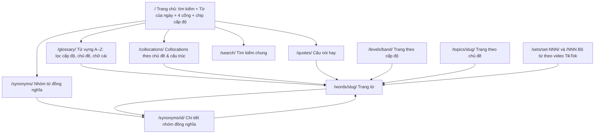
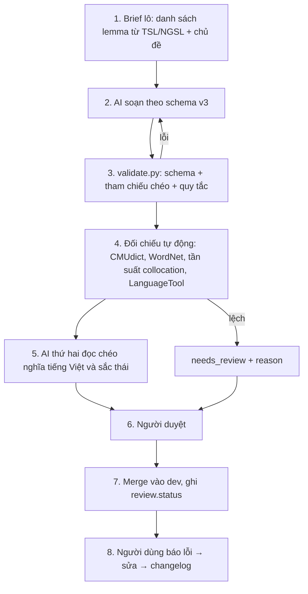
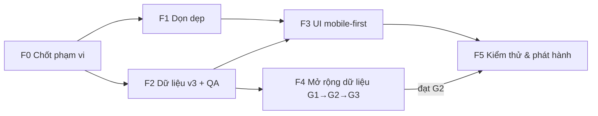

# Kế hoạch Giai đoạn Nền móng – Web Học Từ vựng TOEIC (Glory 01)

**Phiên bản:** 1.0 (bản nháp chờ duyệt) · **Ngày lập:** 10/10/2026 · **Repo:** `vinh-gogo/GLORY-TIKTOK` (Hugo 0.167 + PaperMod + Cloudflare Pages) · **Nhánh làm việc:** `dev`

> **Mục tiêu của giai đoạn này:**
> 1. **Loại bỏ các phần thừa thải** của website hiện tại (vốn dựng theo hướng "TOEIC Speaking theo video").
> 2. **Dựng nền móng** cho một web học **Từ vựng · Collocations · Từ đồng nghĩa · Câu nói hay**.
> 3. **Kho từ vựng đủ nhiều và chuẩn xác ở từng thang điểm**, có kiểm chứng.
> 4. **Mobile-first** (người dùng đến từ TikTok, chủ yếu dùng điện thoại), vẫn tốt trên desktop.
>
> **Ngoài phạm vi giai đoạn này:** audio, flashcard SRS, quiz, đồng hồ thi, ghi âm, AI feedback, PWA. Những phần này để giai đoạn sau, khi nền dữ liệu đã chắc.

---

## Mục lục

0. [Tóm tắt điều hành](#0-tóm-tắt-điều-hành)
1. [Bối cảnh & các mâu thuẫn cần xử lý trước](#1-bối-cảnh--các-mâu-thuẫn-cần-xử-lý-trước)
2. [Hiện trạng đo được (10/10/2026)](#2-hiện-trạng-đo-được-10102026)
3. [Danh mục điểm thừa thải & quyết định](#3-danh-mục-điểm-thừa-thải--quyết-định)
4. [Kiến trúc thông tin mới](#4-kiến-trúc-thông-tin-mới)
5. [Mô hình dữ liệu v3](#5-mô-hình-dữ-liệu-v3)
6. [Thang điểm & phân tầng từ vựng](#6-thang-điểm--phân-tầng-từ-vựng)
7. [Chiến lược nguồn dữ liệu & quy mô](#7-chiến-lược-nguồn-dữ-liệu--quy-mô)
8. [Quy trình đảm bảo chính xác (QA)](#8-quy-trình-đảm-bảo-chính-xác-qa)
9. [Thiết kế Mobile-first](#9-thiết-kế-mobile-first)
10. [Lộ trình theo giai đoạn](#10-lộ-trình-theo-giai-đoạn)
11. [Task Cards](#11-task-cards)
12. [Bản đồ redirect (bảo toàn URL)](#12-bản-đồ-redirect-bảo-toàn-url)
13. [Rủi ro & giảm thiểu](#13-rủi-ro--giảm-thiểu)
14. [Câu hỏi mở cần chủ dự án quyết định](#14-câu-hỏi-mở-cần-chủ-dự-án-quyết-định)
15. [Phụ lục](#15-phụ-lục)

---

## 0. Tóm tắt điều hành

**Định vị mới:** "Glory 01 – Từ điển từ vựng TOEIC cho người học trên điện thoại". Người xem TikTok bấm link bio → tra từ trong ≤ 2 giây → thấy nghĩa, IPA, collocation, từ đồng nghĩa, câu ví dụ → lưu lại / học tiếp theo cấp độ.

**4 trụ cột nội dung:**

| Trụ cột | URL | Nguồn dữ liệu | Kết quả cuối giai đoạn |
| :--- | :--- | :--- | :--- |
| Từ vựng | `/glossary/`, `/words/<slug>/` | `data/lexicon/` | **≥ 1.500 mục từ**, phân đủ 4 tầng điểm |
| Collocations | `/collocations/` | sinh từ `data/lexicon/` (không nhân bản) | **≥ 4.500 collocation** có bằng chứng |
| Từ đồng nghĩa | `/synonyms/`, `/synonyms/<id>/` | `data/synsets/` (mới) | **≥ 300 nhóm đồng nghĩa** có ghi chú sắc thái |
| Câu nói hay | `/quotes/` | `data/quotes/` (tái cấu trúc) | **≥ 100 câu** gốc, mọi collocation đều link tới mục từ có thật |

**3 việc lớn, theo thứ tự phụ thuộc:**
1. **Dọn dẹp** (xóa/gộp/lưu trữ) – không phá URL đã public.
2. **Chuẩn hóa dữ liệu** (schema v3, phân tầng điểm có cơ sở, chủ đề chuẩn, QA tự động) – sửa lại cả 213 từ hiện có.
3. **Dựng lại giao diện mobile-first** + **mở rộng dữ liệu theo lô** đến 1.500 mục.

**Thời lượng ước tính:** ~6 tuần cho phần hệ thống (F0–F3, F5) + ~12–14 tuần cho phần dữ liệu (F4, chạy song song từ tuần 3). Mốc phát hành công khai nền móng: khi đạt cổng G2 (1.000 mục) và UI mobile qua kiểm thử.

---

## 1. Bối cảnh & các mâu thuẫn cần xử lý trước

### 1.1. Giả định đang dùng (cần chủ dự án xác nhận – xem Mục 14)

- Yêu cầu gọi website là "web học reading TOEIC". Repo hiện mang định vị **TOEIC Speaking** (README, `hugo.yaml`, `PLAN_MO_RONG_...`), nhưng **dữ liệu từ vựng thực tế** (vd `consignment`, `tariff`, `dividend`, `vocabulary.md` "TOEIC 700") lại thiên về **từ vựng kinh doanh kiểu TOEIC Listening & Reading**.
- Kế hoạch này giả định: **hướng mới là web từ vựng TOEIC chung, thang điểm tham chiếu là TOEIC Listening & Reading (10–990)**; các tính năng chuyên Speaking bị gỡ khỏi giao diện ở giai đoạn này.

### 1.2. Mâu thuẫn với tài liệu/quy tắc hiện hành

| # | Quy tắc / tài liệu hiện hành | Mâu thuẫn với hướng mới | Đề xuất xử lý |
| :-: | :--- | :--- | :--- |
| C1 | `AGENTS.md` quy tắc 1: phải đọc `PLAN_MO_RONG_Glory01_TOEIC_Speaking.md` | Plan đó mô tả lộ trình Speaking (P0–P7) mà nay phần lớn bị tạm dừng | Viết **ADR-004 "Đổi trọng tâm sang web từ vựng"**; cập nhật `AGENTS.md` để trỏ tới file kế hoạch này (giữ plan cũ trong `docs/archive/` để tham chiếu). **Cần chủ dự án duyệt** vì `AGENTS.md` là hợp đồng làm việc. |
| C2 | `AGENTS.md` quy tắc 6: thông số đề thi đọc từ `data/exam/toeic-speaking.yaml` | Không còn tính năng nào dùng thông số Speaking; trong khi lại cần **một nguồn duy nhất cho thang điểm L&R** | Giữ nguyên tinh thần quy tắc: tạo `data/levels.yaml` (thang điểm + ánh xạ CEFR, có link nguồn ETS và ngày kiểm chứng). Đề xuất sửa quy tắc 6 thành "Mọi thông số đề thi/thang điểm đọc từ `data/exam/*.yaml` và `data/levels.yaml`". File `toeic-speaking.yaml` **giữ lại** (không xóa) cho giai đoạn Speaking sau này. |
| C3 | `AGENTS.md` quy tắc 4: không đổi slug/URL | Gỡ trang Speaking, chuẩn hóa slug chủ đề sẽ làm mất URL | Mọi URL cũ có redirect 301 trong `static/_redirects` (Mục 12) + ghi ADR. |
| C4 | ADR-001: `basis` phải ghi cơ sở, không dùng nhãn điểm như chuẩn chính thức | 133/213 mục đang ghi `basis: "TOEIC 650"`, `"TOEIC 700"`, `"TOEIC 750+"`, `"TOEIC 800+"` | Sửa dữ liệu theo Mục 6; ADR-005 thay thế phần ánh xạ điểm của ADR-001. |

---

## 2. Hiện trạng đo được (10/10/2026)

Số liệu lấy bằng script đọc trực tiếp `data/lexicon/` và các thư mục nguồn:

| Hạng mục | Số liệu | Nhận xét |
| :--- | :--- | :--- |
| Mục từ trong `data/lexicon/` | **213** | Quá ít so với mục tiêu "đủ nhiều ở các thang điểm" |
| Phân tầng `band` | core 106 · target 94 · advanced 13 | Tầng advanced gần như trống; **chưa có tầng cho người mới (≤ 550)** |
| `cefr` ↔ `band` | B1=core, B2=target, C1=advanced **trùng khớp 100%** | Dấu hiệu `band` được suy cơ học từ `cefr`, chưa có cơ sở độc lập |
| `basis` | editorial 80 · "TOEIC 650" 60 · "TOEIC 700" 60 · "TOEIC 750+" 12 · "TOEIC 800+" 1 | Vi phạm ADR-001 (C4) |
| `review.status` | 213/213 = `ai_cross_checked` | 133 mục ghi nguồn là `vocabulary.md`/`synonyms.md` (tài liệu nội bộ, **không phải nguồn đối chiếu độc lập**) |
| Collocations | 709 (TB 3,3/từ), **709/709 ghi `evidence: corpus`** | Không lưu được bằng chứng cụ thể (corpus nào, tần suất bao nhiêu) |
| Synonyms | 463, dạng chuỗi rời | Không có ghi chú sắc thái, không liên kết thành nhóm |
| Ví dụ | 215 (≈ 1/từ) | Mỏng |
| IPA UK | thiếu ở 80 mục | Chấp nhận được (US là chuẩn chính) |
| Chủ đề (`topics`) | **40 slug khác nhau, trùng nghĩa** (vd `sales` / `sales-customer-service` / `customer-service`; `logistics` / `shipping-logistics`; `meetings` / `meetings-office`) | Có cả `describe-picture` (là dạng bài Speaking, không phải chủ đề) |
| `speaking_use` | có ở 213/213 mục | Trường riêng cho Speaking, sinh taxonomy `/parts/` |
| Bộ bài học (`content/sets/`) | 3 set (001, 002, 013) | Link TikTok là placeholder `video/1234567890` |
| `assets/css/extended/custom.css` | 3.285 dòng (~70 KB) | Chứa CSS cho About bento, practice timer, TikTok embed, sets… |
| `layouts/glossary/list.html` | ~29 KB, CSS + JS viết inline | Không cache được, khó bảo trì; render toàn bộ hàng → không chịu nổi 1.500+ từ |
| `scripts/add_lexicon_*.py` | 7 file, ~500 KB | Script một lần, **chứa dữ liệu nhúng** → nguồn sự thật thứ hai |

---

## 3. Danh mục điểm thừa thải & quyết định

**Quy ước quyết định:** `XÓA` (gỡ hẳn, redirect URL) · `GỘP` (hợp nhất vào chỗ khác) · `LƯU TRỮ` (chuyển vào `docs/archive/` hoặc giữ file nhưng không build) · `TINH GỌN` (giữ nhưng bỏ phần thừa) · `GIỮ`.

> Git đã lưu toàn bộ lịch sử, nên "xóa" luôn khôi phục được. Không xóa bất kỳ thứ gì trước khi có redirect tương ứng.

### 3.1. Tính năng & trang

| # | Hạng mục | Bằng chứng thừa | Quyết định | URL bị ảnh hưởng |
| :-: | :--- | :--- | :--- | :--- |
| R1 | Shortcode `practice` + đồng hồ bấm giờ Speaking (`layouts/shortcodes/practice.html`) | Ngoài phạm vi web từ vựng | **XÓA** khỏi giao diện (lưu file vào `docs/archive/speaking/` để dùng lại sau) | không |
| R2 | Bộ bài học `content/sets/` (3 set) | Nặng phần Speaking (practice, learning_objectives, series, parts) | **TINH GỌN** thành "Bộ từ theo video": chỉ còn tiêu đề, danh sách từ (link tới trang từ), nút mở TikTok. Giữ nguyên URL `/sets/set-0NN/` và alias `/001`, `/002`, `/013` (cầu nối từ video TikTok). *Phương án thay thế: xóa + redirect – xem Mục 14, Q3.* | giữ nguyên |
| R3 | Shortcode `tiktok` (facade nhúng video) | Nhúng video làm nặng trang, mobile chậm; người xem vừa từ TikTok sang | **TINH GỌN** thành 1 nút "Xem video trên TikTok ↗" (link thường, không script bên thứ ba) | không |
| R4 | `content/guides/` (1 bài "5 dạng bài Speaking") | Nội dung Speaking | **XÓA** + redirect | `/guides/`, `/guides/01-overview-5-parts/` |
| R5 | Taxonomy `parts` (sinh từ `speaking_use`) | Không còn ý nghĩa | **XÓA** taxonomy + redirect | `/parts/*` |
| R6 | Taxonomy `series`, `tags` | `series` chỉ dùng cho set; `tags` trùng `topics` | **XÓA** + redirect | `/series/*`, `/tags/*` |
| R7 | Trang liệt kê `/words/` (grid) **và** `/glossary/` (bảng) | Hai trang danh sách cùng một dữ liệu | **GỘP**: `/glossary/` là trang danh sách duy nhất; `/words/` (chỉ trang danh sách) redirect 301 về `/glossary/`. Trang chi tiết `/words/<slug>/` **giữ nguyên**. | `/words/` |
| R8 | Hai hệ tìm kiếm: `/search/` (PaperMod + Fuse, index cả `content`) và ô lọc trong `/glossary/` | Trùng chức năng, index Fuse phình theo nội dung | **GỘP** thành 1 bộ tìm kiếm chung (Mục 9.6), dùng ở `/search/`, `/glossary/` và trang chủ. Giữ URL `/search/`. | không |
| R9 | Thẻ "Chi tiết từ vựng" trên trang chủ trỏ cứng `/words/deadline/` | Không có giá trị điều hướng | **XÓA**, thay bằng "Từ của ngày" + 4 cổng trụ cột | không |
| R10 | Trang About bespoke 14 KB (`layouts/about/single.html`) | Nội dung Speaking ("đồng hồ đếm ngược", số giây phòng thi **viết cứng – vi phạm quy tắc 6**), nhiều khối trang trí | **TINH GỌN**: 1 trang ngắn (giới thiệu kênh, phương pháp & nguồn dữ liệu, miễn trừ ETS, cách báo lỗi) | giữ `/about/` |
| R11 | Menu 7 mục | Quá nhiều cho mobile | **TINH GỌN** còn 5 mục (Mục 4.2); "Giới thiệu", "Bộ từ theo video" chuyển xuống footer | không |
| R12 | `params.profileMode` trong `hugo.yaml` | Đã bị `layouts/index.html` ghi đè, không còn dùng | **XÓA** cấu hình chết | không |
| R13 | `ShowCodeCopyButtons`, `ShowShareButtons` (PaperMod), output `JSON` của home cho Fuse | Không có code block; nút chia sẻ PaperMod nặng, không tối ưu mobile | **XÓA**; thay bằng nút "Chia sẻ" dùng Web Share API (Mục 9) | không |

### 3.2. Dữ liệu & schema

| # | Hạng mục | Quyết định |
| :-: | :--- | :--- |
| D1 | Trường `speaking_use` trong lexicon | **XÓA** ở schema v3 (script migrate tự gỡ). Lưu bản sao giá trị cũ trong `docs/archive/speaking/speaking_use.csv` nếu sau này cần. |
| D2 | `basis: "TOEIC 650/700/750+/800+"` | **SỬA** theo quy tắc phân tầng Mục 6 |
| D3 | 40 slug chủ đề trùng lặp | **GỘP** về bộ chủ đề chuẩn (Mục 5.5) + redirect slug cũ |
| D4 | `synonyms` dạng chuỗi rời trong từng mục từ | **TÁCH** thành `data/synsets/` (nhóm đồng nghĩa có sắc thái); mục từ chỉ tham chiếu `synset` id |
| D5 | `evidence: corpus` chung chung | **THAY** bằng object bằng chứng có nguồn + ngày (Mục 5.2) |
| D6 | `schemas/set.v2.json` + kiểm tra practice/exam trong `validate.py` | **TINH GỌN**: set schema v3 chỉ còn trường của "Bộ từ theo video"; bỏ kiểm tra practice timing |
| D7 | `data/quotes.yaml` (1 file, trường `part: "Part 3 & Part 5"`, `insight` nói về Speaking, link `/glossary/?q=prioritize` tới từ **không có** trong lexicon) | **TÁI CẤU TRÚC** thành `data/quotes/*.yaml` theo schema mới; validator bắt buộc mọi link trỏ tới mục từ có thật |

### 3.3. Mã nguồn, tài liệu, tệp rác

| # | Hạng mục | Quyết định |
| :-: | :--- | :--- |
| S1 | `scripts/add_lexicon_batch*.py`, `add_lexicon_group*.py` (7 file, ~500 KB, chứa dữ liệu nhúng) | **XÓA** (git giữ lịch sử). Thay bằng **một** pipeline nhập liệu `scripts/import/` đọc file lô YAML/CSV → kiểm tra → ghi `data/lexicon/`. |
| S2 | `vocabulary.md`, `synonyms.md` ở thư mục gốc | **LƯU TRỮ** sang `sources/raw/` kèm README: "nguồn thô nội bộ, **không** được tính là nguồn đối chiếu" |
| S3 | `ref_vocabularies_style.png`, `ref_vocabularies_style_dark.png` (~2,1 MB, thư mục gốc) | **CHUYỂN** sang `docs/design/` |
| S4 | `PLAN_TikTok_TOEIC_Speaking.md`, `PLAN_MO_RONG_Glory01_TOEIC_Speaking.md` | **LƯU TRỮ** sang `docs/archive/` **sau khi** `AGENTS.md` được cập nhật (C1) |
| S5 | CSS & JS inline trong `layouts/glossary/list.html` | **TÁCH** ra `assets/css/…` và `assets/js/glossary.js` (fingerprint, cache lâu dài) |
| S6 | `custom.css` 3.285 dòng một khối | **TÁCH MODULE** + xóa CSS của R1/R3/R10 sau khi gỡ (chi tiết Mục 9.8) |
| S7 | `.Site.Data` (cảnh báo deprecated trong build) | **SỬA** sang `hugo.Data` khi viết lại template |
| S8 | CI chỉ chạy trên `main` trong khi làm việc trên `dev` | **SỬA** `ci.yml`: chạy cả `push`/`pull_request` vào `dev` |
| S9 | `README.md`, `memory-bank/*`, `.clinerules` mô tả web Speaking | **CẬP NHẬT** ở cuối F1 và cuối giai đoạn |

---

## 4. Kiến trúc thông tin mới

### 4.1. Sơ đồ trang



### 4.2. Điều hướng

| Vị trí | Mobile (≤ 768px) | Desktop (> 768px) |
| :--- | :--- | :--- |
| Thanh chính | **Thanh tab dưới cùng** cố định, 5 mục có icon + nhãn: Từ vựng · Collocations · Đồng nghĩa · Câu hay · Tìm | Header ngang 5 mục như mobile + logo + nút giao diện sáng/tối |
| Header | Gọn: logo + nút sáng/tối (không menu hamburger) | Đầy đủ |
| Footer | Giới thiệu · Bộ từ theo video · Nguồn & phương pháp · Báo lỗi · TikTok | Như mobile |

### 4.3. Trang mới / đổi vai trò

| URL | Trạng thái | Ghi chú |
| :--- | :--- | :--- |
| `/glossary/` | đổi vai trò | Trang danh sách từ duy nhất |
| `/glossary/a/` … `/glossary/z/` | **mới** | Trang tĩnh theo chữ cái – dùng được khi tắt JS, tốt cho SEO, nhẹ cho mobile |
| `/levels/foundation/`, `/levels/core/`, `/levels/target/`, `/levels/advanced/` | **mới** | Từ theo tầng điểm, có giải thích cơ sở phân tầng |
| `/collocations/` (+ trang con theo chủ đề) | **mới** | Sinh từ lexicon, không nhập tay |
| `/synonyms/`, `/synonyms/<id>/` | **mới** | Sinh từ `data/synsets/` bằng Content Adapter |
| `/methodology/` | **mới** | Nguồn & phương pháp: nguồn đối chiếu, giấy phép, cách phân tầng, cách báo lỗi |

---

## 5. Mô hình dữ liệu v3

### 5.1. Nguyên tắc

- **Một nguồn sự thật:** mỗi dữ kiện chỉ nằm ở một nơi. Collocation nằm trong mục từ; trang `/collocations/` chỉ là phép chiếu.
- **Thay đổi có phiên bản:** `schema_version: 3` + `scripts/migrate/v2_to_v3.py` (chạy lại được nhiều lần, không phá dữ liệu).
- **Chỉ thêm trường, không đổi nghĩa trường cũ** (ngoại trừ các trường bị gỡ ở Mục 3.2).
- **Tham chiếu chéo được kiểm tra tự động:** mọi `ref`, `synset`, `link` phải trỏ tới id tồn tại.

### 5.2. Mục từ – `data/lexicon/<chữ đầu>/<id>.yaml`

```yaml
schema_version: 3
id: deadline
lemma: deadline
pos: [noun]
ipa: { us: "/ˈdedlaɪn/" }
level:
  band: core                 # foundation | core | target | advanced  (định nghĩa ở data/levels.yaml)
  cefr: B1                   # nhãn đối chiếu, không chép nội dung nguồn
  basis: [tsl, cefr-ref]     # mã nguồn phân tầng, liệt kê trong data/sources.yaml
  freq_rank: { list: tsl, rank: 0 }   # 0 = chưa tra; điền bằng script, không điền tay
topics: [offices]
senses:
  - id: deadline-1
    meaning_vi: "Hạn chót, thời hạn cuối cùng phải hoàn thành công việc"
    note_vi: "Nhấn mạnh áp lực thời gian của công việc/dự án."
collocations:
  - phrase: "meet a deadline"
    pattern: V+N             # V+N | ADJ+N | N+N | N+PREP | V+PREP | ADV+ADJ | PHRASE
    meaning_vi: "kịp hạn chót"
    evidence:
      source: ngram          # mã nguồn trong data/sources.yaml
      checked_at: 2026-10-12
      note: ""               # tùy chọn: ghi số liệu/tần suất nếu có
synsets: [syn-deadline-target-date]  # tham chiếu data/synsets/
confused_words: [...]        # giữ cấu trúc v2
confusing_meanings: [...]    # giữ cấu trúc v2
examples:
  - en: "We often have to work overtime to meet tight deadlines at the end of the quarter."
    vi: "Chúng tôi thường phải làm thêm giờ để kịp các hạn chót gấp gáp vào cuối quý."
review:
  status: ai_cross_checked   # ai_draft | ai_cross_checked | human_verified | needs_review
  checked_by: [cmudict, model-b]
  checked_at: 2026-10-12
  reason: ""                 # BẮT BUỘC khi status = needs_review
```

**Thay đổi so với v2:** bỏ `speaking_use`; `level.band` thêm giá trị `foundation`; `level.basis` thành danh sách mã nguồn; thêm `level.freq_rank`; `collocations[].pattern` và `collocations[].evidence` (object); `synonyms` → `synsets` (tham chiếu); `review.reason`.

### 5.3. Nhóm đồng nghĩa – `data/synsets/<id>.yaml` (mới)

Trọng tâm: **sắc thái khác nhau** giữa các từ gần nghĩa – đúng điểm người học hay sai khi chọn từ.

```yaml
schema_version: 1
id: syn-increase
head_vi: "Tăng lên"
pos: verb
members:
  - word: increase
    ref: increase              # id lexicon nếu đã có; validator cảnh báo nếu chưa có
    register: neutral          # neutral | formal | informal
    nuance_vi: "Trung tính, dùng được cả có tân ngữ (increase prices) và không có tân ngữ (prices increased)."
  - word: rise
    register: neutral
    nuance_vi: "Không có tân ngữ (prices rose). Muốn có tân ngữ dùng raise."
  - word: boost
    register: neutral
    nuance_vi: "Thường có tân ngữ, mang nghĩa thúc đẩy theo hướng tích cực (boost sales)."
not_interchangeable_vi: "Không viết *rise the price*; dùng raise/increase the price."
examples:
  - en: "The new campaign helped boost sales in the third quarter."
    vi: "Chiến dịch mới đã giúp thúc đẩy doanh số trong quý ba."
review: { status: ai_draft, checked_at: 2026-10-12 }
```

> Ví dụ trên chỉ để minh họa cấu trúc; nội dung thật vẫn phải qua pipeline Mục 8 (đối chiếu WordNet + người duyệt).

### 5.4. Câu nói hay – `data/quotes/<id>.yaml` (tái cấu trúc từ `data/quotes.yaml`)

```yaml
schema_version: 1
id: law-01
title_vi: "Định luật về Hạn chót"
title_en: "The Law of Deadlines"
topic: offices                # dùng bộ chủ đề chuẩn
band: core                    # cấp độ của từ vựng trong câu
quote_en: "If you fail to prioritize tasks early, you will always sacrifice quality just to meet a tight deadline."
quote_vi: "Nếu bạn không chủ động ưu tiên công việc từ sớm, bạn sẽ luôn phải đánh đổi chất lượng chỉ để kịp một hạn chót gấp gáp."
highlights:                   # cụm từ được tô sáng trong câu
  - phrase: "meet a tight deadline"
    word: deadline            # BẮT BUỘC là id lexicon có thật (validator kiểm)
  - phrase: "prioritize tasks"
    word: prioritize          # nếu chưa có trong lexicon → phải thêm mục từ trước, hoặc bỏ highlight
origin: original              # original | attributed (nếu trích danh ngôn: bắt buộc có author + nguồn kiểm chứng được)
review: { status: ai_cross_checked, checked_at: 2026-10-12 }
```

- Bỏ trường `part` ("Part 3 & Part 5") và đoạn `insight` theo Speaking.
- **Câu gốc tự viết** là mặc định. Nếu dùng danh ngôn của người thật thì phải có `author` + nguồn kiểm chứng; không có nguồn → không đăng (tránh "danh ngôn bịa").

### 5.5. Bộ chủ đề chuẩn – `data/topics.yaml`

Đề xuất bám theo các nhóm bối cảnh mà ETS mô tả cho bài thi TOEIC Listening & Reading (**AI phải đối chiếu lại danh sách trên trang ETS ở F0 trước khi chốt**):

| Slug mới | Tên hiển thị | Gộp từ slug cũ |
| :--- | :--- | :--- |
| `general-business` | Kinh doanh chung (hợp đồng, đàm phán, marketing, bán hàng, bảo hành) | `business`, `contracts`, `contracts-negotiation`, `legal`, `legal-compliance`, `sales`, `sales-customer-service`, `customer-service`, `marketing`, `marketing-advertising` |
| `offices` | Văn phòng (họp, email, thiết bị, thủ tục) | `work`, `meetings`, `meetings-office`, `email`, `equipment`, `management`, `management-operations` |
| `personnel` | Nhân sự (tuyển dụng, lương, thăng chức, hưu trí) | `hiring`, `human-resources`, `salary-benefits`, `benefits`, `training` |
| `finance-budgeting` | Tài chính & ngân sách | `finance-accounting`, `budget`, `banking` |
| `manufacturing` | Sản xuất & chất lượng | `manufacturing`, `production-quality-control` |
| `purchasing` | Mua hàng, đặt hàng, vận chuyển | `shipping-logistics`, `logistics`, `shopping` |
| `travel` | Du lịch, khách sạn, đi lại | `hospitality-travel`, `travel`, `hotels`, `transport` |
| `housing-property` | Nhà ở & bất động sản doanh nghiệp | `real-estate-construction` |
| `technical-areas` | Công nghệ & kỹ thuật | `technology` |
| `dining-out` | Ăn uống, nhà hàng | — |
| `entertainment` | Giải trí, sự kiện | `events` (cần duyệt từng từ) |
| `health` | Sức khỏe | — |
| `corporate-development` | Phát triển doanh nghiệp (nghiên cứu, phát triển sản phẩm) | — |

- `daily-life`, `education`: duyệt thủ công từng mục để xếp vào nhóm phù hợp.
- `describe-picture`: **xóa** khỏi `topics` (là dạng bài Speaking).
- Mỗi mục từ có 1–3 chủ đề; validator chặn slug không có trong `data/topics.yaml`.

### 5.6. Cấp độ – `data/levels.yaml` (nguồn duy nhất cho thang điểm)

Xem Mục 6. Mọi trang hiển thị khoảng điểm đều đọc từ file này; **không viết cứng con số điểm trong template hay nội dung.**

### 5.7. Nguồn dữ liệu – `data/sources.yaml`

Danh mục mã nguồn được phép dùng trong `basis`, `evidence.source`, `checked_by`: tên, URL, giấy phép, cách dùng được phép (đối chiếu / trích dữ liệu), ngày kiểm tra giấy phép. Validator chặn mã nguồn không có trong danh mục.

---

## 6. Thang điểm & phân tầng từ vựng

### 6.1. Nguyên tắc

- **ETS không công bố danh sách từ vựng theo điểm.** Mọi nhãn "từ này dành cho mức X điểm" đều là **phân loại biên tập** và phải nói rõ như vậy trên web (`/methodology/`).
- Khung ánh xạ dựa trên **nguồn chính thức có thể kiểm chứng**: hướng dẫn ánh xạ điểm TOEIC Listening & Reading sang CEFR do ETS công bố.

### 6.2. Bảng tham chiếu ETS (ghi vào `data/levels.yaml`)

Số liệu dưới đây là mức tối thiểu theo hướng dẫn ánh xạ CEFR của ETS cho TOEIC Listening & Reading. **Trạng thái: cần đối chiếu lại văn bản gốc trên ets.org ở F0, ghi URL + ngày kiểm chứng vào `data/levels.yaml` trước khi hiển thị.**

| CEFR | Tổng điểm (tham khảo) | Listening tối thiểu | Reading tối thiểu |
| :-: | :-: | :-: | :-: |
| C1 | 945–990 | 490 | 455 |
| B2 | 785–944 | 400 | 385 |
| B1 | 550–784 | 275 | 275 |
| A2 | 225–549 | 110 | 115 |

### 6.3. Bốn tầng biên tập

| `band` | Nhãn hiển thị | CEFR của từ (đối chiếu) | Gợi ý mục tiêu điểm (đọc từ `levels.yaml`) | Ý nghĩa sư phạm |
| :--- | :--- | :-: | :--- | :--- |
| `foundation` **(mới)** | Nền tảng | A2 | đang hướng tới mức A2 → B1 | Từ thông dụng xuất hiện dày đặc trong đề, người mới phải chắc trước |
| `core` | Cốt lõi | B1 | mức B1 | Từ kinh doanh phổ biến nhất |
| `target` | Mục tiêu | B2 | mức B2 | Từ giúp vượt các câu khó, đoạn đọc dài |
| `advanced` | Nâng cao | C1 | mức C1 | Từ ít gặp, sắc thái tinh, thường là bẫy |

> Cách hiển thị đề xuất: "**Cốt lõi** · B1 · thường cần cho mục tiêu ~550–780" kèm biểu tượng (i) dẫn tới `/methodology/`. Lý do chọn khoảng theo ETS thay vì mốc quen thuộc "450/650/850": có nguồn kiểm chứng được. *(Quyết định cuối – Mục 14, Q2.)*

### 6.4. Thuật toán gán `band` (viết thành script, không gán tay)

1. **Tín hiệu A – CEFR của từ:** lấy từ nguồn đối chiếu có giấy phép phù hợp (ứng viên: CEFR-J Wordlist; nhãn CEFR của từ điển learner chỉ dùng để đối chiếu, không sao chép nội dung). Kiểm tra giấy phép ở F0.
2. **Tín hiệu B – Tần suất trong ngữ cảnh TOEIC/kinh doanh:** thứ hạng trong **TOEIC Service List (TSL)** / **Business Service List (BSL)** / **NGSL** (CC BY-SA 4.0).
3. **Quy tắc:**
   - A và B **đồng thuận** (ví dụ: CEFR B1 + nằm trong nhóm tần suất cao của TSL/NGSL) → gán band tương ứng, `review` có thể lên `ai_cross_checked`.
   - A và B **lệch nhau ≥ 1 tầng** → gán theo A, đặt `review.status: needs_review`, `reason: "band lệch giữa CEFR và tần suất"` → người duyệt quyết.
   - Không có tín hiệu A → `needs_review` (không đoán).
4. Ghi `level.basis` = danh sách nguồn đã dùng; ghi `freq_rank` bằng script.
5. Ngưỡng tần suất cụ thể (vd hạng 1–600 TSL = core…) chốt trong **ADR-005** sau khi chạy thử trên 213 từ hiện có và xem phân bố.

### 6.5. Hệ quả với 213 từ hiện có

- Chạy lại thuật toán cho cả 213 mục; dự kiến **phân bố band sẽ thay đổi** (hiện đang trùng khớp CEFR 100%).
- Mục nào đổi band → ghi vào `docs/changelog-data.md`.

---

## 7. Chiến lược nguồn dữ liệu & quy mô

### 7.1. Nguồn được phép dùng (phải xác minh giấy phép ở F0 rồi ghi `data/sources.yaml`)

| Mục đích | Nguồn ứng viên | Giấy phép (cần xác minh) | Cách dùng |
| :--- | :--- | :--- | :--- |
| Danh sách từ ứng viên + tần suất | TSL, BSL, NGSL (Browne & Culligan) | CC BY-SA 4.0 | Lấy **danh sách lemma + thứ hạng**; ghi công trên `/methodology/`. ⚠️ ShareAlike: nếu danh sách từ của web được xem là "tác phẩm phái sinh" thì phần đó phải chia sẻ cùng giấy phép → ghi ADR-006 |
| CEFR của từ | CEFR-J Wordlist (ứng viên) | cần kiểm | Chỉ lấy nhãn cấp độ |
| IPA (US) | CMU Pronouncing Dictionary | giấy phép dạng BSD (cần kiểm) | Chuyển ARPAbet → IPA bằng script; so khớp với IPA trong dữ liệu |
| Đối chiếu IPA / từ loại | Wiktionary | CC BY-SA | Chỉ đối chiếu, không chép định nghĩa |
| Quan hệ đồng nghĩa | Princeton WordNet | giấy phép WordNet (cho phép dùng, cần ghi công) | Xác nhận 2 từ có cùng synset/quan hệ gần; **ghi chú sắc thái tự viết** |
| Bằng chứng collocation | Google Books Ngram Viewer, SkELL | điều khoản sử dụng của từng dịch vụ | Kiểm tần suất cụm; lưu `evidence.source` + ngày. Không thu thập tự động trái điều khoản |
| Đối chiếu nghĩa | Từ điển Oxford/Cambridge/Longman learner | bản quyền | **Chỉ đọc để đối chiếu**, không chép câu chữ (quy tắc 3) |
| Kiểm ngữ pháp câu ví dụ | LanguageTool | LGPL (bản tự chạy) | Chạy trong pipeline |

`vocabulary.md` / `synonyms.md`: chỉ là **danh sách ứng viên nội bộ**, không bao giờ được ghi vào `checked_by`/`sources` như một nguồn kiểm chứng.

### 7.2. Chỉ tiêu "đủ nhiều" – đo được

| Chỉ số | Hiện tại | Cổng G1 | Cổng G2 | Cổng G3 (hết giai đoạn) |
| :--- | :-: | :-: | :-: | :-: |
| Tổng mục từ (đã publish) | 213 | 500 | 1.000 | **1.500** |
| — foundation | 0 | 100 | 200 | 250 |
| — core | 106 | 250 | 450 | 550 |
| — target | 94 | 120 | 270 | 500 |
| — advanced | 13 | 30 | 80 | 200 |
| Độ phủ TSL (lemma TSL có trong lexicon, trừ hư từ) | chưa đo | ≥ 30% | ≥ 60% | **≥ 90%** |
| Collocation có `evidence` cụ thể | 0 | 1.500 | 3.000 | **4.500** (≥ 3/từ) |
| Câu ví dụ | 215 | 500 | 1.000 | **≥ 1.500** (≥ 1/từ, ưu tiên 2 cho core/target) |
| Nhóm đồng nghĩa (`synsets`) | 0 | 80 | 180 | **300** |
| Câu nói hay | 12 | 30 | 60 | **100** |

> Ưu tiên sản xuất: **core → foundation → target → advanced**, trong mỗi tầng ưu tiên theo thứ hạng tần suất TSL. Lý do: lợi ích cho số đông người học trước.

### 7.3. Nhịp sản xuất theo lô

- **1 lô = 50 mục từ** cùng chủ đề hoặc cùng dải tần suất.
- Quy trình mỗi lô (Mục 8): brief → AI soạn → validate → đối chiếu tự động → AI thứ hai → người duyệt → merge.
- Nhịp đề xuất: **2 lô/tuần (≈ 100 mục)** khi người duyệt đủ thời gian; nếu duyệt là nút thắt thì giảm còn 1 lô/tuần và kéo dài F4. → 1.287 mục mới cần **~13 tuần** ở nhịp 2 lô/tuần.
- File lô đặt tại `sources/batches/NNN-<chủ-đề>.yaml`; script `scripts/import/import_batch.py` sinh file `data/lexicon/` (không viết tay từng file).

---

## 8. Quy trình đảm bảo chính xác (QA)

Kế thừa Mục 6 của `PLAN_MO_RONG_...`, bổ sung các kiểm tra tự động dưới đây.

### 8.1. Luồng



### 8.2. Kiểm tra tự động (bổ sung vào `scripts/validate/`)

| Mã | Kiểm tra | Mức |
| :-: | :--- | :-: |
| V1 | JSON Schema v3 cho lexicon, synsets, quotes, sets | Lỗi |
| V2 | `id` trùng tên file; `lemma` không trùng giữa các mục | Lỗi |
| V3 | Mọi `ref`, `synsets[]`, `highlights[].word`, `words[]` trỏ tới id có thật | Lỗi |
| V4 | `topics[]` ∈ `data/topics.yaml`; `band` ∈ `data/levels.yaml`; mã nguồn ∈ `data/sources.yaml` | Lỗi |
| V5 | IPA chỉ chứa ký tự trong tập IPA cho phép, có dấu `/…/` | Lỗi |
| V6 | IPA US khớp CMUdict (sau chuyển đổi); không có trong CMUdict → cảnh báo, yêu cầu `needs_review` | Cảnh báo |
| V7 | Collocation chứa lemma (hoặc dạng biến tố); không trùng lặp trong cùng mục | Lỗi |
| V8 | Câu ví dụ chứa lemma (hoặc dạng biến tố) | Lỗi |
| V9 | `needs_review` phải có `reason` | Lỗi |
| V10 | `ai_cross_checked` trở lên phải có `checked_by` gồm ≥ 1 nguồn độc lập (không phải `vocabulary.md`, `synonyms.md`, `glory-editorial`) | Lỗi |
| V11 | Collocation phải có `evidence.source` + `checked_at` (áp dụng cho mục mới; mục cũ có hạn chót di trú) | Lỗi / Cảnh báo |
| V12 | Tiếng Việt thiếu dấu: chuỗi `*_vi` dài > 20 ký tự mà không có ký tự có dấu → cảnh báo | Cảnh báo |
| V13 | `band` lệch quy tắc Mục 6.4 so với `cefr`/`freq_rank` mà không có `needs_review` | Cảnh báo |
| V14 | Không có số điểm viết cứng trong `layouts/` và `content/` (grep mẫu `\b\d{3}\+`, "TOEIC \d{3}") | Lỗi |

### 8.3. Trạng thái hiển thị

- Chỉ mục `ai_cross_checked` trở lên mới xuất hiện trong danh sách, tìm kiếm, `/collocations/`, `/synonyms/`.
- Mục **đã từng public** mà bị hạ xuống `needs_review`: **trang `/words/<slug>/` vẫn giữ** (không phá URL), hiển thị dải thông báo "Mục này đang được kiểm duyệt lại", ẩn khỏi danh sách cho tới khi sửa xong. *(Quyết định – Mục 14, Q4.)*
- Huy hiệu "Đã kiểm duyệt" chỉ cho `human_verified`.

### 8.4. Tái kiểm toán 213 mục hiện có (bắt buộc trong F2)

1. Chạy migrate v2 → v3.
2. Chạy V1–V14 + đối chiếu CMUdict/WordNet/tần suất collocation.
3. Mục không có nguồn độc lập (V10) → `needs_review` với `reason` cụ thể; người duyệt xử lý theo lô.
4. Báo cáo kết quả trong `docs/audit-2026-10-lexicon-v3.md` (số mục đạt, số mục hạ trạng thái, lý do).

---

## 9. Thiết kế Mobile-first

### 9.1. Nguyên tắc

1. **Thiết kế cho màn 360–390px trước**, mở rộng dần lên tablet/desktop (CSS `min-width` media queries).
2. **Dùng được bằng một tay:** thao tác chính nằm ở nửa dưới màn hình (thanh tab dưới, nút lọc dạng bottom sheet).
3. **Tối ưu cho trình duyệt trong app TikTok** (in-app browser/WebView): người dùng đến từ link bio sẽ mở trong WebView của TikTok trước tiên.
4. **Progressive enhancement:** HTML tĩnh đọc được khi tắt JS; JS chỉ thêm lọc/tìm tức thì.
5. **Nhẹ là ưu tiên:** không web font nặng, không script bên thứ ba ở trang nội dung.

### 9.2. Breakpoints

| Tên | Khoảng | Bố cục chính |
| :--- | :--- | :--- |
| `xs` | < 400px | 1 cột, thẻ từ dạng card, thanh tab dưới |
| `sm` | 400–767px | 1 cột, card rộng hơn |
| `md` | 768–1023px | 2 cột card; header ngang thay thanh tab dưới |
| `lg` | ≥ 1024px | `/glossary/` dạng bảng; trang từ 2 cột (nội dung + cột phụ: đồng nghĩa, từ liên quan) |

### 9.3. Đặc tả từng trang

**Trang chủ `/`**
- Ô tìm kiếm ở đầu trang (font ≥ 16px để iOS không tự phóng to; **không** autofocus để bàn phím không bật lên che nội dung).
- "Từ của ngày" (chọn theo ngày phía client từ index; fallback tĩnh khi tắt JS).
- 4 cổng trụ cột dạng lưới 2×2 trên mobile.
- Chip cấp độ: Nền tảng · Cốt lõi · Mục tiêu · Nâng cao (kèm số lượng từ, đọc từ dữ liệu).
- "Từ trong video mới nhất" → set mới nhất.

**Từ vựng `/glossary/`**
- Mobile: danh sách card (lemma · IPA · loại từ · 1 dòng nghĩa · chip band). Desktop ≥ 1024px: bảng có header dính.
- Thanh chữ cái A–Z cuộn ngang, chip ≥ 44px.
- Nút "Bộ lọc" mở **bottom sheet**: cấp độ, chủ đề, loại từ. Hiển thị số kết quả trực tiếp.
- **Không render toàn bộ 1.500+ hàng một lúc:** HTML tĩnh chỉ chứa 50 mục đầu + liên kết tới `/glossary/a/`…; JS tải index rút gọn (Mục 9.6) rồi hiển thị thêm theo từng đợt 50 mục khi cuộn ("Xem thêm").
- Trạng thái lọc lưu trên URL (`?band=core&topic=offices&letter=d`) để chia sẻ được và nút Back hoạt động đúng.

**Trang từ `/words/<slug>/`** – thứ tự nội dung trên mobile:
1. Lemma (to) · IPA · loại từ · chip band + chủ đề.
2. Nghĩa tiếng Việt (các sense).
3. Collocations (danh sách, tô đậm lemma, nhãn pattern).
4. Câu ví dụ EN/VI.
5. Từ đồng nghĩa (link sang `/synonyms/<id>/`, kèm 1 dòng sắc thái).
6. Từ dễ nhầm (thu gọn mặc định – `<details>`).
7. Điều hướng: "← Từ trước / Từ tiếp →" là **nút ở cuối nội dung** (không dùng cử chỉ vuốt – dễ xung đột với cử chỉ Back của trình duyệt và WebView TikTok). Phím ← → trên desktop giữ nguyên.
8. Nút "Chia sẻ" (Web Share API; fallback: sao chép link) + "Báo lỗi".

**Collocations `/collocations/`**
- Nhóm theo chủ đề (tab cuộn ngang) và theo pattern (V+N, ADJ+N…).
- Mỗi dòng: cụm từ · nghĩa · link về trang từ. Phân trang theo chủ đề để mỗi trang nhẹ.

**Đồng nghĩa `/synonyms/` và `/synonyms/<id>/`**
- Danh sách nhóm: tiêu đề tiếng Việt + các từ thành viên dạng chip.
- Trang chi tiết: bảng so sánh sắc thái (mobile: mỗi thành viên là 1 card), câu "không thay thế được cho nhau", ví dụ.

**Câu nói hay `/quotes/`**
- Card: câu EN (cụm highlight là link tới trang từ) · câu VI · chip chủ đề/cấp độ. Lọc theo chủ đề.

**Bộ từ theo video `/sets/set-NNN/` (`/NNN`)**
- Tiêu đề · nút "Xem video trên TikTok ↗" · danh sách card các từ trong video. Không nhúng video.

### 9.4. Chi tiết kỹ thuật bắt buộc

- `<meta name="viewport" content="width=device-width, initial-scale=1, viewport-fit=cover">`; thanh tab dưới dùng `padding-bottom: env(safe-area-inset-bottom)`.
- Chiều cao dùng `dvh`/`svh` thay `100vh` (tránh lỗi thanh địa chỉ trên iOS).
- Vùng chạm ≥ 44×44px; khoảng cách giữa các vùng chạm ≥ 8px.
- Cỡ chữ nội dung ≥ 16px; IPA dùng font stack hỗ trợ ký tự IPA (`system-ui, "Segoe UI", Roboto, "Noto Sans", "Helvetica Neue", Arial, sans-serif`) – kiểm tra hiển thị `ˈ ə ʊ ɪ ʃ ʒ θ ð ŋ ɜː` trên Android đời thấp và iOS.
- Không có tương tác chỉ dựa vào hover; tooltip `title` không dùng để chứa thông tin quan trọng.
- `localStorage` có thể bị xóa/không ổn định trong WebView → mọi tính năng phải chạy được khi không có bộ nhớ lưu trữ.
- Không dùng `window.open`/popup; link ngoài dùng `target="_blank" rel="noopener"`.
- Ảnh (nếu có) `loading="lazy"`, có `width/height` để tránh nhảy bố cục.
- Tôn trọng `prefers-reduced-motion` và `prefers-color-scheme` (giữ sáng/tối tự động).

### 9.5. Ngân sách hiệu năng (cổng chặn phát hành)

| Chỉ số | Ngưỡng |
| :--- | :--- |
| Lighthouse mobile – Performance / Accessibility / Best Practices / SEO | **≥ 90** mỗi mục (mục tiêu 95) |
| LCP (4G giả lập, máy tầm trung) | ≤ 2,0 s |
| CLS | ≤ 0,05 |
| HTML mỗi trang (gzip) | ≤ 50 KB |
| CSS toàn site (gzip) | ≤ 25 KB |
| JS mỗi trang (gzip) | ≤ 30 KB |
| Index tìm kiếm tải lần đầu (gzip) | ≤ 100 KB ở 1.500 mục (đo thực tế; vượt thì chia mảnh theo chữ cái) |

### 9.6. Tìm kiếm chung (thay R8)

- Hugo sinh `/search-index.json` rút gọn (custom output format): `id, lemma, ipa, pos, band, topics, meaning_vi (rút gọn), collocations (chỉ phrase), synset heads`.
- JS tự viết (~3–5 KB), **chuẩn hóa tiếng Việt không dấu** (NFD + bỏ dấu, `đ → d`) để "han chot" ra "hạn chót".
- Xếp hạng: khớp lemma chính xác > tiền tố lemma > collocation > nghĩa tiếng Việt.
- Tải index **lười** (khi người dùng chạm vào ô tìm kiếm), cache bằng HTTP cache.
- Nếu index vượt ngân sách: chia mảnh theo chữ cái đầu, hoặc đánh giá Pagefind (ADR riêng).

### 9.7. Ma trận kiểm thử thiết bị

| Thiết bị / kích thước | Trình duyệt |
| :--- | :--- |
| 360×800 (Android tầm trung) | Chrome Android, **WebView trong app TikTok (Android)** |
| 375×667 (iPhone SE) | Safari iOS |
| 390×844 (iPhone 13/14) | Safari iOS, **WebView trong app TikTok (iOS)** |
| 768×1024 (tablet) | Safari iPadOS / Chrome |
| 1280×800, 1440×900 (desktop) | Chrome, Edge, Firefox, Safari macOS |

Kịch bản kiểm thử tối thiểu: mở link bio → tra 1 từ → mở trang từ → sang nhóm đồng nghĩa → quay lại (Back) đúng vị trí lọc → chuyển sáng/tối → xoay ngang màn hình.

### 9.8. Tổ chức lại CSS/JS

```
assets/
├── css/extended/
│   ├── 00-tokens.css        # biến màu, khoảng cách, cỡ chữ, màu 4 band
│   ├── 10-base.css          # typography, IPA, link, focus ring
│   ├── 20-layout.css        # header, bottom tab bar, footer, container
│   ├── 30-components.css    # word-card, chip, badge, bottom-sheet, details
│   └── 40-pages.css         # glossary, word, collocations, synonyms, quotes, home
└── js/
    ├── search.js            # tìm kiếm chung + chuẩn hóa không dấu
    ├── glossary.js          # lọc, đồng bộ URL, tải dần
    └── share.js             # Web Share API + fallback
```

- JS nạp bằng Hugo Pipes (`resources.Get | js.Build | minify | fingerprint`), `defer`, chỉ ở trang cần.
- Xóa CSS của practice/timer, TikTok embed, About bento sau khi gỡ R1/R3/R10; kiểm lại bằng script dò class không dùng (đã thử: hiện có 14/280 class không còn được tham chiếu).

---

## 10. Lộ trình theo giai đoạn

| GĐ | Tên | Thời lượng | Phụ thuộc | Đầu ra chính |
| :-: | :--- | :-: | :--- | :--- |
| **F0** | Chốt phạm vi & quyết định | 2–3 ngày | — | ADR-004, 005, 006; `AGENTS.md` cập nhật (đã duyệt); `data/levels.yaml`, `data/topics.yaml`, `data/sources.yaml` bản đầu có nguồn |
| **F1** | Dọn dẹp | 1 tuần | F0 | Gỡ R1–R13, S1–S5; `static/_redirects`; build xanh, không link hỏng |
| **F2** | Dữ liệu v3 & QA | 1,5–2 tuần | F0 (song song cuối F1) | Schema v3, migrate, validator V1–V14, pipeline nhập lô, báo cáo tái kiểm toán 213 mục |
| **F3** | UI mobile-first | 2 tuần | F1, F2 (schema) | Điều hướng mới, 4 trụ cột, tìm kiếm chung, CSS module, đạt ngân sách 9.5 |
| **F4** | Mở rộng dữ liệu | ~13 tuần (song song từ tuần 3) | F2 | Cổng G1 → G2 → G3 (Mục 7.2) |
| **F5** | Kiểm thử & phát hành | 1 tuần (lặp lại ở mỗi cổng) | F3 + G2 | Ma trận thiết bị 9.7 đạt, merge `dev → main`, cập nhật README/memory-bank |



**Định nghĩa hoàn thành (DoD) chung cho mọi task** (theo `AGENTS.md`):
1. `python scripts/validate/validate.py` → 0 lỗi.
2. `hugo --gc --minify` → build thành công, không cảnh báo mới.
3. Không URL cũ nào trả 404 (chạy script kiểm redirect – T1.6).
4. Mô tả task: đã làm gì · kiểm tra thế nào · điều gì chưa chắc chắn.

---

## 11. Task Cards

> Mỗi card = một mục tiêu, một PR/commit nhóm trên nhánh `dev` (hoặc `ai/<task-id>` rồi merge vào `dev`).

### F0 – Chốt phạm vi

**T0.1 – ADR-004: Đổi trọng tâm sang web từ vựng**
- File: `docs/adr/004-pivot-vocabulary-platform.md`
- Nội dung: bối cảnh (Mục 1), quyết định (Mục 3), hệ quả (URL, tính năng tạm dừng, file lưu trữ).
- Nghiệm thu: chủ dự án duyệt.

**T0.2 – Cập nhật `AGENTS.md`** *(chỉ làm sau khi chủ dự án đồng ý)*
- Quy tắc 1 trỏ tới file kế hoạch này; quy tắc 6 mở rộng sang `data/levels.yaml` (C2).
- Nghiệm thu: diff nhỏ, không đổi các quy tắc khác.

**T0.3 – `data/levels.yaml` + ADR-005**
- Đối chiếu bảng ánh xạ CEFR trên ets.org; ghi `official_source`, `verified_date`; định nghĩa 4 band + nhãn hiển thị.
- Nghiệm thu: mọi con số có nguồn; không mục nào "đoán".

**T0.4 – `data/topics.yaml` + bảng ánh xạ slug cũ → mới**
- Đối chiếu danh sách nhóm bối cảnh của ETS; chốt Mục 5.5.
- Nghiệm thu: 40 slug cũ đều có đích; slug không chắc → ghi chú cần duyệt.

**T0.5 – `data/sources.yaml` + ADR-006 (giấy phép & ghi công)**
- Kiểm tra giấy phép TSL/BSL/NGSL, CEFR-J, CMUdict, WordNet, Wiktionary, Ngram/SkELL; ghi rõ cách dùng được phép, nghĩa vụ ghi công, tác động ShareAlike.
- Nghiệm thu: mỗi nguồn có URL giấy phép + ngày kiểm tra.

### F1 – Dọn dẹp

**T1.1 – Gỡ tính năng Speaking khỏi giao diện (R1, R3, R4, R9, R10)**
- Chuyển `layouts/shortcodes/practice.html` và nội dung `content/guides/` vào `docs/archive/speaking/`; `tiktok.html` → nút link đơn giản; viết lại trang About ngắn; bỏ thẻ "Chi tiết từ vựng" ở trang chủ.
- Nghiệm thu: build xanh; grep không còn chuỗi "Speaking Lab", "phòng thi", số giây viết cứng trong `layouts/`, `content/`.

**T1.2 – Tinh gọn bộ từ theo video (R2)**
- Bỏ `practice`, `learning_objectives`, `series`, `parts`, `level_band` khỏi 3 set; giữ `title`, `date`, `summary`, `tiktok`, `aliases`, `words`, `topics`.
- Thay `archetypes/sets.md` bằng khung mới; cập nhật `schemas/set.v3.json`.
- Nghiệm thu: `/001`, `/002`, `/013` vẫn mở được; mỗi set hiển thị đúng danh sách từ.
- ⚠️ Link TikTok trong 3 set đang là placeholder `1234567890` → cần chủ dự án cung cấp link thật hoặc ẩn nút khi chưa có.

**T1.3 – Gỡ taxonomy `parts`, `series`, `tags` (R5, R6) và trang danh sách `/words/` (R7)**
- Sửa `hugo.yaml` (`taxonomies`), `content/words/_content.gotmpl` (bỏ `parts`), cấu hình build để không render trang danh sách `/words/` nhưng vẫn render trang con (AI phải xác minh cú pháp `build` options trên Hugo 0.167 bằng tài liệu chính thức và build thử).
- Nghiệm thu: `/words/deadline/` vẫn có; `/words/`, `/parts/*`, `/series/*`, `/tags/*` redirect đúng.

**T1.4 – Dọn cấu hình & menu (R11, R12, R13)**
- Xóa `profileMode`, `fuseOpts` (sau khi T3.4 xong), `ShowCodeCopyButtons`, `ShowShareButtons`; menu 5 mục.
- Nghiệm thu: build xanh; header hiển thị 5 mục.

**T1.5 – Dọn tệp (S1–S4)**
- Xóa `scripts/add_lexicon_*.py`; chuyển `vocabulary.md`, `synonyms.md` → `sources/raw/` (+ README); ảnh tham chiếu → `docs/design/`; plan cũ → `docs/archive/` (sau T0.2).
- Nghiệm thu: thư mục gốc chỉ còn file cấu hình/tài liệu chính.

**T1.6 – `static/_redirects` + script kiểm tra redirect**
- Viết redirect theo Mục 12; script `scripts/validate/check_urls.py` so sánh danh sách URL của bản build trước (lưu `docs/url-inventory-2026-10.txt`) với bản build mới + `_redirects` → không URL nào bị mất.
- Kiểm tra giới hạn số dòng `_redirects` hiện hành của Cloudflare Pages.
- Nghiệm thu: script trả 0 URL mất.

**T1.7 – CI chạy trên `dev` (S8)**
- Nghiệm thu: push vào `dev` kích hoạt validate + build.

### F2 – Dữ liệu v3 & QA

**T2.1 – Schema v3** (`schemas/word.v3.json`, `synset.v1.json`, `quote.v1.json`, `set.v3.json`)
- Nghiệm thu: có test mẫu hợp lệ/không hợp lệ cho mỗi schema.

**T2.2 – `scripts/migrate/v2_to_v3.py`**
- Gỡ `speaking_use`; ánh xạ `topics` theo T0.4; `basis` chuỗi → danh sách; `evidence: corpus` → `{source: unverified}` + đánh dấu cần bổ sung; `synonyms` → đề xuất synset (ghi ra file chờ duyệt, không tự tạo synset).
- Chạy lại nhiều lần cho kết quả giống nhau (idempotent).
- Nghiệm thu: 213/213 file qua schema v3.

**T2.3 – Validator V1–V14** (`scripts/validate/validate.py` + module con)
- Nghiệm thu: mỗi quy tắc có ít nhất 1 test lỗi cố ý.

**T2.4 – Công cụ đối chiếu tự động**
- `scripts/ipa/check_cmudict.py` (V6), `scripts/qa/check_synonyms_wordnet.py`, `scripts/qa/collocation_evidence.py` (hỗ trợ người duyệt ghi bằng chứng; tuân thủ điều khoản dịch vụ).
- Nghiệm thu: chạy trên 213 mục, xuất báo cáo CSV.

**T2.5 – Script gán band (Mục 6.4)** `scripts/levels/assign_band.py`
- Nghiệm thu: chạy trên 213 mục, xuất bảng so sánh band cũ/mới; ngưỡng chốt vào ADR-005.

**T2.6 – Pipeline nhập lô** `scripts/import/import_batch.py` + mẫu `sources/batches/_template.yaml`
- Nghiệm thu: nhập thử 1 lô 10 mục từ đầu đến cuối.

**T2.7 – Tái kiểm toán 213 mục** → `docs/audit-2026-10-lexicon-v3.md`
- Nghiệm thu: mọi mục có trạng thái đúng thực tế; mục `needs_review` có `reason`.

**T2.8 – Tái cấu trúc Câu nói hay** → `data/quotes/*.yaml`
- Bỏ `part`, `insight` Speaking; mọi `highlights[].word` trỏ tới lexicon có thật (thêm mục từ nếu thiếu, qua pipeline).
- Nghiệm thu: `/quotes/` vẫn mở được; V3 không lỗi.

### F3 – UI mobile-first

**T3.1 – Design tokens + CSS module (Mục 9.8)** – Nghiệm thu: CSS gzip ≤ 25 KB; giao diện cũ không vỡ.
**T3.2 – Khung điều hướng:** header gọn, thanh tab dưới (mobile), footer – Nghiệm thu: đạt 9.4 (safe-area, 44px).
**T3.3 – Trang chủ mới (Mục 9.3)** – Nghiệm thu: LCP ≤ 2,0 s mobile.
**T3.4 – Tìm kiếm chung (Mục 9.6)** – Nghiệm thu: "deadline", "han chot", "meet a" đều cho kết quả đúng; index ≤ ngân sách.
**T3.5 – `/glossary/` + `/glossary/<chữ>/`** (card mobile / bảng desktop, bottom sheet lọc, trạng thái trên URL, tải dần) – Nghiệm thu: mượt ở 1.500 mục giả lập.
**T3.6 – Trang từ mới (thứ tự mục 9.3)** – Nghiệm thu: không cuộn ngang ở 360px; phím ← → vẫn chạy trên desktop.
**T3.7 – `/collocations/`** – Nghiệm thu: số collocation hiển thị = số trong dữ liệu đã publish.
**T3.8 – `/synonyms/` + trang chi tiết (Content Adapter)** – Nghiệm thu: mọi thành viên có `ref` link đúng trang từ.
**T3.9 – `/quotes/` mới** – Nghiệm thu: highlight là link hoạt động.
**T3.10 – `/levels/<band>/`, `/topics/<slug>/`, `/methodology/`** – Nghiệm thu: khoảng điểm đọc từ `data/levels.yaml` (V14 không lỗi).
**T3.11 – Chia sẻ & báo lỗi** (Web Share API + fallback; nút báo lỗi mở GitHub Issue điền sẵn id mục) – Nghiệm thu: chạy được trong WebView TikTok hoặc có fallback.

### F4 – Mở rộng dữ liệu

**T4.x – Lô NNN (50 mục/lô)** – lặp lại:
1. Lấy 50 lemma theo thứ tự ưu tiên (Mục 7.2) chưa có trong lexicon.
2. AI soạn theo schema v3 (nghĩa/ví dụ/ghi chú tự viết, không chép từ điển).
3. Chạy validate + đối chiếu tự động; AI thứ hai đọc chéo.
4. Người duyệt; mục chưa chắc → `needs_review` + `reason`.
5. Merge; cập nhật bảng tiến độ cổng G1/G2/G3 trong `memory-bank/progress.md`.
- Song song: mỗi tuần thêm ~20 synset và ~8 câu nói hay liên kết với từ đã có.
- Nghiệm thu mỗi lô: 0 lỗi validate; tỉ lệ lỗi người duyệt phát hiện ghi lại để quyết định khi nào chuyển từ duyệt 100% sang duyệt mẫu (theo 6.3 của plan cũ: < 1% trên 50 lô liên tiếp… điều chỉnh thành **5 lô liên tiếp** do lô lớn hơn – cần chủ dự án duyệt).

### F5 – Kiểm thử & phát hành

**T5.1 – Lighthouse CI + kiểm thử ma trận thiết bị 9.7** – Nghiệm thu: đạt 9.5 trên các trang: `/`, `/glossary/`, 1 trang từ, `/collocations/`, `/synonyms/`, `/quotes/`.
**T5.2 – Kiểm tra link hỏng + redirect (T1.6)** – Nghiệm thu: 0 lỗi.
**T5.3 – Cập nhật README, `memory-bank/*`, `.clinerules`** – Nghiệm thu: mô tả đúng định vị mới.
**T5.4 – Merge `dev → main`** tại cổng G2 và G3.

---

## 12. Bản đồ redirect (bảo toàn URL)

Bản nháp `static/_redirects` (Cloudflare Pages, 301). **Phải sinh danh sách URL thực tế từ bản build hiện tại (T1.6) trước khi chốt.**

```text
# --- Trang danh sách gộp ---
/words/                      /glossary/                   301

# --- Nội dung Speaking đã gỡ ---
/guides/                     /                            301
/guides/*                    /                            301
/parts/                      /glossary/                   301
/parts/*                     /glossary/                   301
/series/                     /sets/                       301
/series/*                    /sets/                       301
/tags/                       /glossary/                   301
/tags/*                      /glossary/                   301

# --- Chủ đề cũ → chủ đề chuẩn (sinh tự động từ data/topics.yaml) ---
/topics/business/            /topics/general-business/    301
/topics/sales-customer-service/  /topics/general-business/  301
/topics/work/                /topics/offices/             301
/topics/hiring/              /topics/personnel/           301
/topics/shipping-logistics/  /topics/purchasing/          301
/topics/hospitality-travel/  /topics/travel/              301
# ... (đủ 40 slug cũ)
/topics/describe-picture/    /glossary/                   301
```

- `/sets/*`, `/001`, `/002`, `/013`, `/words/<slug>/`, `/quotes/`, `/about/`, `/search/`, `/glossary/`, `/topics/` **giữ nguyên**.
- Các dòng `/topics/...` nên được **sinh bằng script** từ bảng ánh xạ trong `data/topics.yaml` để không lệch dữ liệu.

---

## 13. Rủi ro & giảm thiểu

| Rủi ro | Xác suất | Tác động | Giảm thiểu |
| :--- | :-: | :-: | :--- |
| Dữ liệu sai (IPA/nghĩa/collocation) khi tăng nhanh lên 1.500 mục | Cao | Cao | Pipeline Mục 8, V1–V14, duyệt 100% giai đoạn đầu, `needs_review` thay vì đoán |
| Gán "mức điểm" gây hiểu lầm là chuẩn ETS | Trung bình | Cao | Nhãn biên tập + `/methodology/` + số điểm chỉ đọc từ `levels.yaml` có nguồn |
| Vi phạm giấy phép (CC BY-SA ShareAlike, từ điển có bản quyền) | Trung bình | Cao | ADR-006, ghi công, không chép câu chữ từ điển |
| Mất URL đã chia sẻ trên TikTok | Trung bình | Cao | `_redirects` + script kiểm URL ở CI |
| Người duyệt là nút thắt cổ chai | Cao | Trung bình | Lô 50 mục, ưu tiên theo tần suất, chuyển sang duyệt mẫu khi tỉ lệ lỗi thấp |
| Trang danh sách chậm trên điện thoại khi dữ liệu lớn | Trung bình | Trung bình | Trang theo chữ cái, tải dần, index rút gọn, ngân sách 9.5 |
| Khác biệt hành vi trong WebView TikTok | Trung bình | Trung bình | Kiểm thử thiết bị thật, không phụ thuộc `localStorage`/popup |
| Làm lại UI quá tay (over-engineering) | Trung bình | Trung bình | Không framework; mỗi task một mục tiêu; giữ PaperMod làm khung |

---

## 14. Câu hỏi mở cần chủ dự án quyết định

| # | Câu hỏi | Đề xuất mặc định |
| :-: | :--- | :--- |
| Q1 | Hướng mới là **từ vựng TOEIC Listening & Reading** (thang 10–990) hay vẫn gắn TOEIC Speaking? | L&R (thang 10–990); giữ dữ liệu Speaking để mở lại sau |
| Q2 | Hiển thị mức điểm theo **ngưỡng ETS–CEFR** (550 / 785 / 945) hay theo mốc quen thuộc (450 / 650 / 850)? | Theo ngưỡng ETS–CEFR vì có nguồn kiểm chứng |
| Q3 | Bộ từ theo video (`/sets/`, `/001`…): **tinh gọn và giữ** hay **xóa + redirect**? Các video TikTok đã đăng có dẫn `/0NN` chưa? Link video thật là gì? | Tinh gọn và giữ (cầu nối TikTok → web) |
| Q4 | Mục đã public nhưng bị hạ `needs_review` khi tái kiểm toán: giữ trang kèm thông báo, hay tạm ẩn hẳn? | Giữ trang + thông báo, ẩn khỏi danh sách |
| Q5 | Đồng ý cập nhật `AGENTS.md` (C1, C2) và chuyển 2 file plan cũ vào `docs/archive/`? | Đồng ý |
| Q6 | Giấy phép nội dung của web (all rights reserved hay CC BY-NC-SA…)? Liên quan ShareAlike của TSL/NGSL. | Quyết định trong ADR-006 sau khi kiểm tra giấy phép |
| Q7 | Có thêm tầng `foundation` (A2) cho người mới không? | Có – nhóm người xem TikTok có nhiều người mới bắt đầu |
| Q8 | Ai là người duyệt nội dung, bao nhiêu giờ/tuần? (quyết định nhịp 1 hay 2 lô/tuần) | Cần chủ dự án cho biết |

---

## 15. Phụ lục

### 15.1. Lệnh kiểm tra chuẩn

```powershell
python scripts/validate/validate.py
hugo --gc --minify
python scripts/validate/check_urls.py      # sau T1.6
```

### 15.2. Checklist kiểm thử mobile (mỗi lần phát hành)

- [ ] Mở link bio từ app TikTok (iOS + Android) → trang chủ hiển thị < 2 giây trên 4G.
- [ ] Ô tìm kiếm không bị iOS phóng to khi chạm; gõ không dấu vẫn ra kết quả.
- [ ] Thanh tab dưới không bị che bởi thanh home của iPhone (safe-area).
- [ ] `/glossary/`: lọc theo cấp độ + chữ cái + chủ đề, bấm vào từ, nhấn Back → giữ nguyên bộ lọc và vị trí cuộn.
- [ ] Trang từ không cuộn ngang ở 360px; IPA hiển thị đủ ký tự.
- [ ] Nút Chia sẻ hoạt động (hoặc fallback sao chép link).
- [ ] Chế độ sáng/tối đều đủ tương phản (WCAG AA).
- [ ] Tắt JS: trang chủ, `/glossary/<chữ>/`, trang từ vẫn đọc được.
- [ ] `/001`, `/002`, `/013` và mọi URL trong `docs/url-inventory-2026-10.txt` không 404.

### 15.3. Các ADR dự kiến

| ADR | Chủ đề |
| :-: | :--- |
| 004 | Đổi trọng tâm sang web từ vựng; danh sách tính năng gỡ/tạm dừng |
| 005 | Thang điểm & thuật toán phân tầng `band` (thay phần ánh xạ điểm của ADR-001) |
| 006 | Nguồn dữ liệu, giấy phép, ghi công, giấy phép nội dung của web |
| 007 | Tìm kiếm chung tự viết thay Fuse/PaperMod search (hoặc Pagefind nếu vượt ngân sách) |
| 008 | Tách nhóm đồng nghĩa thành `data/synsets/` |

### 15.4. Điều chưa chắc chắn trong bản kế hoạch này

- Bảng ánh xạ ETS–CEFR (Mục 6.2) lấy từ tra cứu web, **chưa đối chiếu văn bản gốc** trên ets.org → T0.3.
- Danh sách nhóm bối cảnh ETS (Mục 5.5) viết theo hiểu biết chung, **chưa đối chiếu** → T0.4.
- Giấy phép TSL/BSL/NGSL (CC BY-SA 4.0) theo trang dự án NGSL; giấy phép CEFR-J, CMUdict, WordNet, điều khoản Ngram/SkELL **chưa kiểm tra** → T0.5.
- Cú pháp Hugo để không render trang danh sách `/words/` mà vẫn render trang con **cần build thử** → T1.3.
- Giới hạn số dòng `_redirects` của Cloudflare Pages **cần kiểm tra bản hiện hành** → T1.6.
- Chỉ tiêu số lượng (Mục 7.2) và nhịp 2 lô/tuần phụ thuộc thời gian của người duyệt (Q8).
