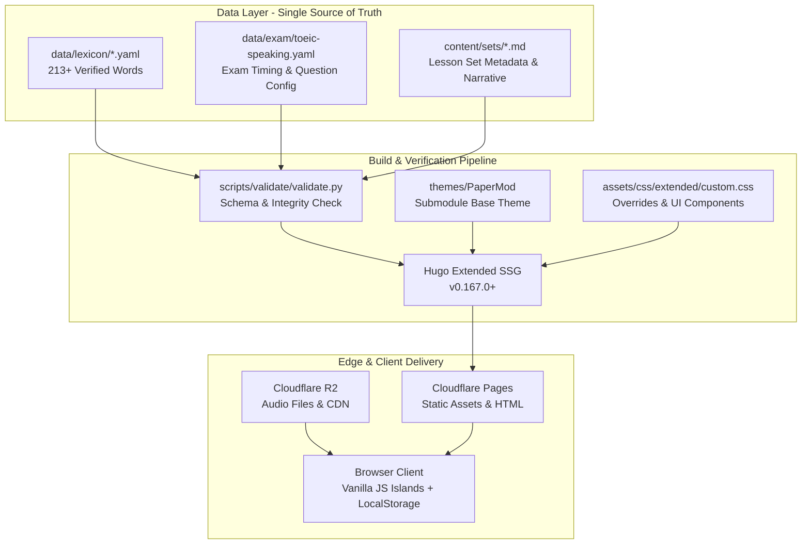

# System Patterns: GLORY-TIKTOK

> **Cập nhật 2026-10 — ĐỊNH HƯỚNG ĐÃ ĐỔI.** Sản phẩm chuyển từ site luyện TOEIC Speaking sang nền tảng từ vựng / collocations / đồng nghĩa / câu nói hay, mobile-first. Các phần bên dưới nói về Speaking (bộ đếm giờ, 11 dạng câu hỏi, `data/exam/toeic-speaking.yaml`, `/parts/`, `/guides/`, `custom.css`) là **lịch sử**; nguồn đúng hiện hành: `PLAN_NEN_MONG_Tu_Vung_TOEIC.md`, `docs/adr/004`–`008` và `activeContext.md`. Nội dung Speaking cũ lưu ở `docs/archive/`.

## 1. System Architecture

---

## 2. Key Architecture Decisions (ADRs)

- **ADR-001: Editorial 3-Tier Level Classification**
  - *Context:* ETS does not publish an official word list with cut-off scores (e.g. "TOEIC 550+"). Using score brackets is misleading.
  - *Decision:* Adopt editorial levels: `Core` (high frequency foundation), `Target` (score-driving collocations), and `Advanced` (nuanced idioms and formal phrasing).
  - *Status:* Implemented across all 213 lexicon files and UI filters with dedicated color coding (Core: green, Target: blue, Advanced: purple).

- **ADR-002: Central Lexicon Architecture**
  - *Context:* Storing vocabulary in front matter of individual lesson sets caused high duplication and inconsistent definitions.
  - *Decision:* Centralize all vocabulary entries in `data/lexicon/<lemma>.yaml`. Lesson sets (`content/sets/*.md`) reference entries via lexicon IDs. Hugo content adapters and layouts project individual pages under `/words/<lemma>/`.
  - *Status:* Implemented. 213 central YAML files validated by `validate.py`.

- **ADR-003: Audio Hosting on Object Storage (Cloudflare R2)**
  - *Context:* Generating audio for 2,500+ words and responses exceeds Cloudflare Pages' file count and repository bandwidth limits.
  - *Decision:* Store audio files externally on Cloudflare R2, loaded lazily via client audio widgets.
  - *Status:* Architecture planned for Phase 3.

---

## 3. Design & Component Patterns

### 3.1. Layout & Styling Strategy
- **PaperMod Extended Architecture:**
  - Base theme remains an untouched submodule in `themes/PaperMod/`.
  - All customizations live in `layouts/` and `assets/css/extended/custom.css`.
  - PaperMod's `reset.css` applies `display: block` and `overflow-x: auto` to `table`, which breaks `position: sticky` on `thead`. We override this in `.glossary-table-container` to maintain sticky headers.
- **Defensive CSS Grid Sizing:**
  - For side-by-side or bottom navigation cards, grid columns must be defined as `minmax(0, 1fr)` rather than simple `1fr` to prevent long textual content from expanding track widths and distorting balanced layouts.
  - Card containers and text wrappers enforce `min-width: 0`, `overflow: hidden`, and `text-overflow: ellipsis`.

### 3.2. Scripting & Client Interactions
- **Vanilla JS Islands:** Zero heavy client framework dependencies. All interactivity (live filter, search, keyboard shortcuts) is lightweight and vanilla JS.
- **Mutual Filter Clearing:**
  - Searching via input box resets active letter and level filters.
  - Clicking an A–Z letter or level filter clears the search input, toggles active state, and scrolls the table smoothly to top.

### 3.3. Data Validation Pipeline
- Python validation script (`scripts/validate/validate.py`) enforces strict schema validation:
  - Required fields: `id`, `lemma`, `pos`, `ipa`, `level`, `definition_vi`, `examples`.
  - Collocation structure and review status flags.
  - Exam timing configuration checks.
